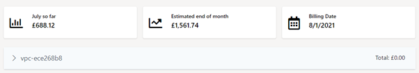

# Cost Management
This is the area where you can monitor and manage your spend on eCloud VPC as well as look at our pricing/calculator to predict spend before purchasing eCloud VPC

## Calculator
You can build your solution using our calculator to see what your costs would be at the PAYG rate before starting.

By default the page will load with one VPC, if you are planning to have multiple VPCs you can add as many as you like with the add VPC button.

## Spend Summary

Your spend summary shows the total accumulated spend for the month, the estimation for the month and when your next billing date is (1st of the month). You will be able to cycle through the previous months in an upcoming update.
Spend is broken down per VPC, this view collates all of your VPCs across all of your estate and is not filtered by region



## Pricing
If you need to check the price of anything quickly before you purchase you can do so on this page, each regions costs for each resource is defined by the hour and the average for a month also shown (730 hours). Currently all pricing for every region is the same.

```eval_rst
   .. title:: Cost Management
   .. meta::
      :title: Cost Management | ANS Documentation
      :description: Managing your Spend with eCloud VPC
      :keywords: ecloud, ecloud VPC, ANS Portal, VPC, Virtual Private Cloud, Cost Management
```