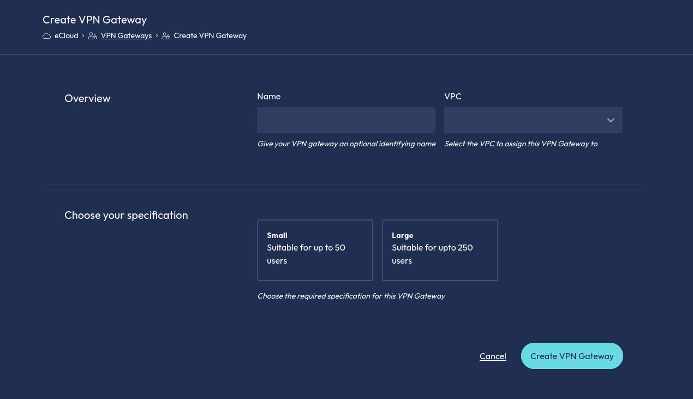
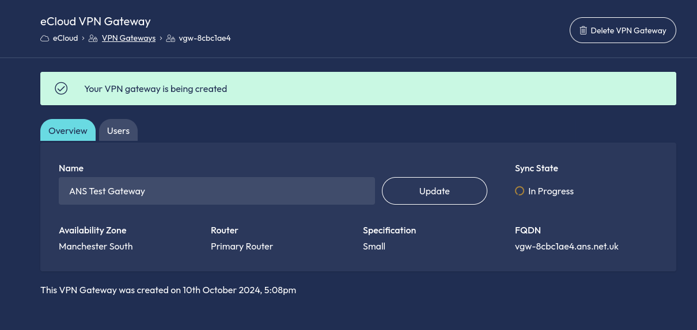
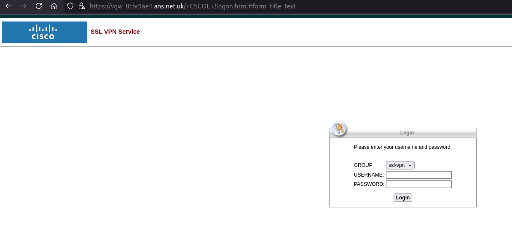
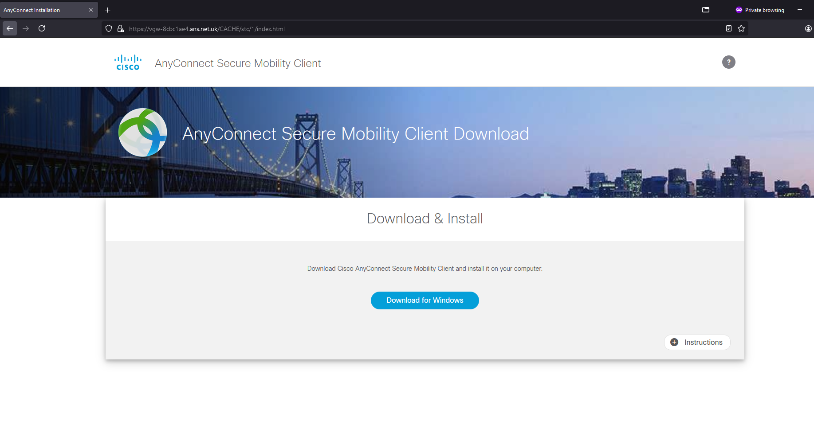

# Point to Site VPNs

In eCloud VPC you have the ability to set up Point-to-Site VPNs (Virtual Private Networks), often known as 
Remote-Access or Client-Access VPNs, allowing remote workers to connect to your eCloud VPC networks securely from their location.


### How it works

In order to set up a Point-to-Site VPN, you will need to create a VPN Gateway and configure users for the VPN connection.

The Gateway appliance will be deployed behind your chosen VPC router and will act as the endpoint for the VPN connection and
route traffic to the relevant networks.

Available in 2 specifications to suit your use case, a small gateway for upto 50 users and a large gateway for upto 250 users.

In order to help you manage costs, we have split the VPN Gateway billing into two parts, the Gateway itself and the user license packs.
User Licenses are available in packs of 25, with a minimum of 25 users required, and a maximum of 50 or 250 users depending on the Gateway specification you have chosen.


### How to create a VPN Gateway

To create a VPN Gateway, navigate to the VPN Gateway section from the eCloud VPC menu and select `Create Gateway`

You will be asked to select the VPC Router you wish to deploy the Gateway behind, the Gateway specification and the number of user licenses required.



Your Gateway will then be deployed, this may take a few moments while we configure the networking, you can track 
progress via the resource sync state, once complete you will be available to configure your users.




### Managing your VPN Gateway

You can manage your VPN Gateway from the VPN Gateway section of the GLASS portal, via the api, terraform, or cli tools.

You can view the status of your Gateway, the access hostname for new connections and view the number of user licenses in use.


#### How to configure users

To configure users for your VPN Gateway, navigate to the VPN Gateway section from the eCloud VPC menu and select the Gateway you wish to configure users for.

Select the `Users` tab and then `Create User` to create a new user, or select a user to edit or delete.


#### Connecting to your VPN

To connect to your VPN Gateway, you will need to install the Cisco AnyConnect client on your computer, or use a compatible alternative.

If you do not have a vpn client installed, you can download the AnyConnect Client from your VPN Gateway by accessing
the Gateway in your browser using the hostname provided in the GLASS portal and logging in with your vpn username and password.



The VPN Gateway provides users with the installation package and setup instructions for Windows, Mac and Linux devices. 



Once installed, users can connect to your VPN Gateway using the credentials created in the GLASS portal.


### Deleting your VPN Gateway

When you no longer require your VPN Gateway, you can delete it from the GLASS portal by selecting the Gateway and then `Delete Gateway`.

Any active user sessions will be terminated and the Gateway will be removed from your VPC.


```eval_rst
   .. title:: eCloud VPC Point-to-Site VPNs
   .. meta::
      :title: eCloud VPC Point-to-Site VPNs | ANS Documentation
      :description: Point-to-Site VPNs in eCloud VPC
      :keywords: eCloud, eCloud VPC, ANS GLASS, VPC, Virtual Private Cloud, VPN, Point-to-Site, Remote Access VPN, VPN Gateway, Cisco, AnyConnect
```