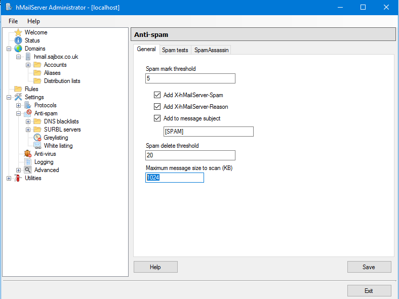
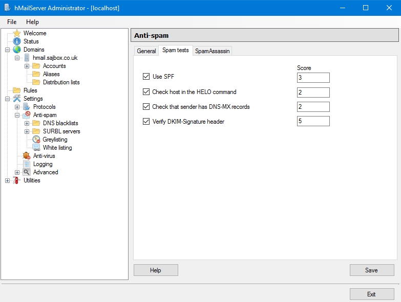
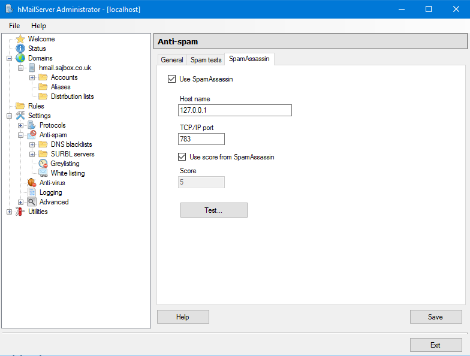
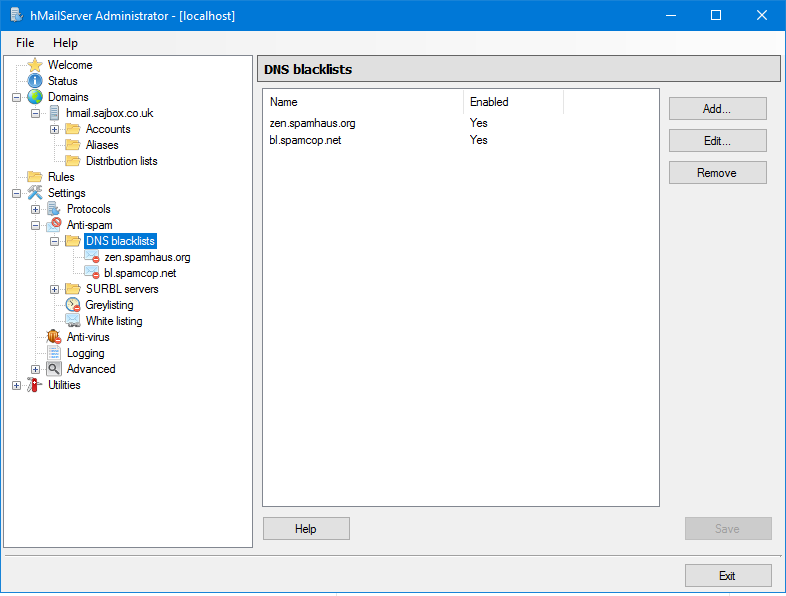
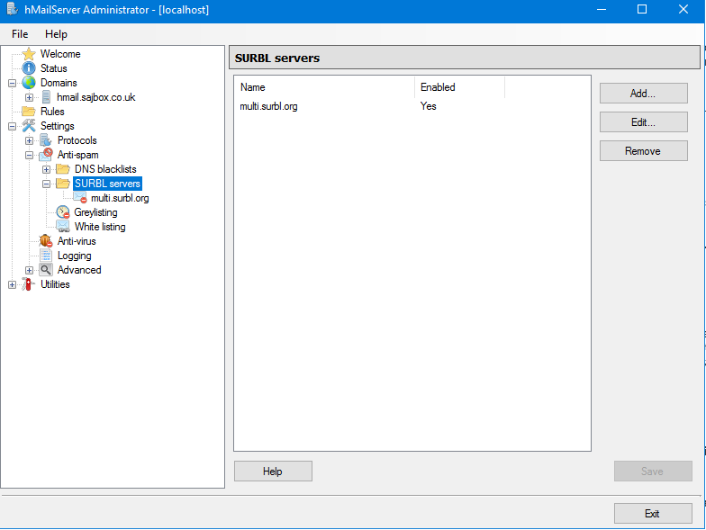
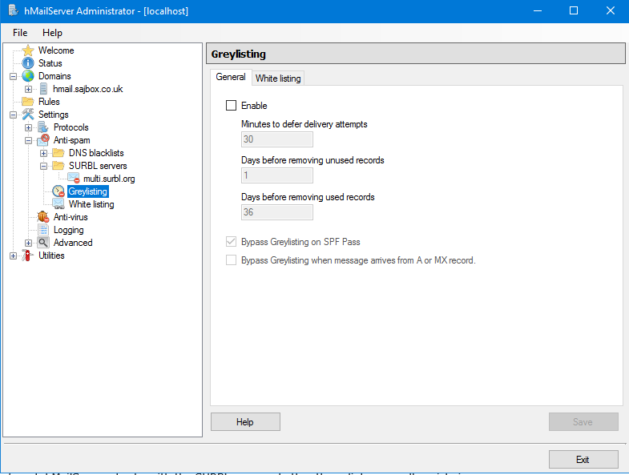
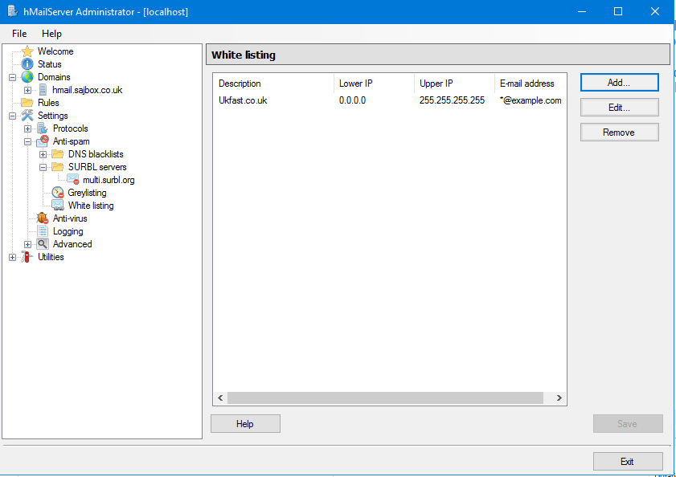

# hMailServer - Anti-spam Setup

hMailServer comes with some Anti-Spam protection enabled out-of-the-box. This article is designed to help you make sure this is configured and provide some further options to help make it its spam detection even better.

- Start by logging into your `hMailServer Administrator` program. This can be found in the Start Menu on your server. 
- Once signed in proceed to
`Settings > Anti-Spam`

From here we will be configuring hMail’s anti-spam settings, covering them tab-by-tab.

## General



- **Spam mark Threshold** is used to determine how high a score an email needs before it is marked as spam. 

  Lowering this figure will make your server stricter with spam but also heighten the chance of false-positives, potentially marking legitimate mail as spam if set too low. We recommend leaving this at the default of "5" and changing this higher or lower after a period of testing.

- **Add to message subject** is used in conjunction with Spam Mark Threshold. When an email hits your Spam Mark Threshold score it will have the start of its Subject line marked with "[SPAM]". 

  You can modify this text to say something else if needed. This is useful as it will alert your Accounts in hMail that an email may be spam. People using Outlook can also create rules in outlook to automatically move emails marked with tag to their ‘Junk’ folders.

- **Add x-hMailServer-Spam** will insert the score an email has received into the message headers. This is useful for review, providing the specific score individual mail items have received.

- **Add x-hMailServer-Reason** will show the justification for an email's spam score.

- **Spam Delete Threshold** will _delete_ an email if it is scored at or above the specifid value. Mail items deleted in this manner _cannot_ be recovered. 

  This is usually set to 20 which is quite lenient. Spam scores should be reviewed for a period of time prior to lowering this. We would not normally recommend a value any lower than "10".

- **Maximum message size to scan (KB)** is the maximum size an email can be and still be scanned. In normal conditions you will not need to increase this above 1024. Higher values will result in greater CPU usage. 


## Spam Tests



- **Use SPF** - Default value is "3". This will only trigger when a domain hard-fails an SPF check. As such if you are seeing issues with spam, we would recommend changing this to 5. You can read further about SPF in our [main SPF guide](/email/spf).

- **Check host in the HELO Command** - Default value is "2". This will compare the hostname used in the sending mail server's HELO to its rDNS (PTR) record. We would recommend changing this to "3".

- **Check that sender had DNS-MX records** - Default value is "2". This will make sure that the sender domain has MX reccords. Any legitimate domain sending mail should have MX records. As such, we recommend setting this score to "5".

- **Verify DKIM-Signature header** - Default value is "5". If the relevant sending domain has a DKIM DNS record, hMail will check to make sure the message's DKIM signature matches. If it does not, the check will fail. We recommend leaving this at the default value.

```eval_rst
.. note::
   If no DKIM signature is included in the message's headers, this check will not be executed.
```

## SpamAssassin



**SpamAssassin** is a popular, third-party mail filter that is updated regularly with additional rules for detecting spam messages. SpamAssassin requires some setup (allow approx. 20 minutes) but we would highly recommend it. An example implementation can be found on the hMailServer forum:

- <https://www.hmailserver.com/forum/viewtopic.php?t=28133>

## DNS Blocklists



**DNS Blocklists** are lists maintained by different organisations that track IPs' associated mail traffic. When these are enabled it will check domains that email your server to ensure they are not on any blocklists. If the sending IP is blocked, it will reject the message. 

hMail believe enabling this can cut down spam by as much as 15-25% and we would recommend enabling the default lists:

- zen.spamhaus.org
- bl.spamcop.net

## SURBL Servers



**SURBL servers** work differently to DNS check lists by checking links in the body of the message. This will check incoming emails to see if they contain links to known-malicious websites. 

## Grey Listing



**Grey Listing** works by _temporarily_ rejecting any mail sent to your server; a correctly configured mail server will almost always attempt to resend a message rejected in this manner, being successful on the second attempt. 

hMail will keep a log of the sending IP for the initial message and compare this against any retry attempts. Most spam mail servers will typically _not_ try to resend a message once it has been rejected. 

This process can cause issues as the retry delay can be lengthy (minutes / hours) and large mail servers can send from multiple IPs. This can cause delays in delivery to your server until the same email is sent by the same IP twice. For this reason, we typically advise against enabling Grey Listing. 

If you do enable this feature we would recommend allowing large mail providers such as Google, Hotmail (etc.) and companies with which you deal regularly.

## White Listing



**White Listing** will allow you to specify domains or individual email addresses to bypass your spam filtering. You can also specify the IP range that is whitelisted for that domain.

For further information on Hmail’s anti-Spam features, please refer to the official documentation:

- <https://www.hmailserver.com/documentation/v5.3/?page=details_antispam_methods>

```eval_rst
   .. title:: Email | hMailServer - Anti-spam Setup
   .. meta::
      :title: Email | hMailServer - Anti-spam Setup
      :description: A guide to anti-spam configurations in hMailServer
      :keywords: ukfast, windows, hMail, hMailServer, mail, email, spam
```
