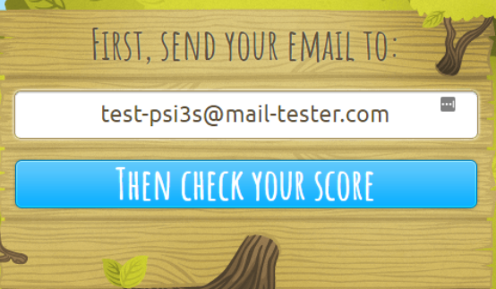

# Testing Mail

Guidance on how to use `mail-tester.com` and understanding the results.

## **Purpose**
Mail-tester is used to test the 'quality' of emails - taking into consideration:
* Your message's content
* Your mailserver's configuration
* The IP address your mail is being sent from

## **How to use it**
Firstly, go to https://www.mail-tester.com in your browser. You should see something similar to:


As instructed by the webpage, send the email you wish to test from the desired address (for example, sending a company newsletter from the appropriate address).

**You should avoid generic phrases such as** 'this is a test' **as it will likely be flagged as spam**.

Once you have sent the email, click the 'then check your score' button to proceed.

## **The results**
If no other tests were recently sent to the same address as your email, you will automatically be taken to the message sent (as below). From this, you can scroll down to see the full report.


If your test results aren't displayed automatically, a list will appear for you to select from. This includes the subject line, spam rating, and how long ago the email was submitted.

### **Explanation of Results**


### View of message
'Click here to view your message' simply displays your email's content in basic HTML & plain text view. The 'source' section within this gives more detailed information on the mail servers sending and receiving your mail (including their IP addresses, and what protocol was used to encrypt the email's content).

### SpamAssassin
[SpamAssassin](https://spamassassin.apache.org/) is a spam-filtering program, which uses various techniques to determine whether or not your mail will be flagged as spam. IN the example below, SpamAssassin found no issues as the records it
checks were valid, such as SPF.

SPF (Sender Policy Framework) records allow the recipient to check that your mail is authentic. The SPF record defines which mail servers are allowed to send from your domain (such as @ukfast.co.uk).

If any checks were unsuccessful, this will likely decrease the overall rating given by mail-tester. For example, SpamAssassin shows that this message is not signed with DKIM (this serves the same purpose as SPF by different means). While the lack of DKIM deducts 1/10 from the overall score, it isn;t entirely necessary as most spam filters won't consider its absence to be a huge concern.


### Email Formatting

The fourth section evaluates how well formatted your email is. This includes:

* What percentage of your message is text - a lack of special characters and punctuation may suggest an email looks more like spam.

* Whether it includes images - image-based emails make it more difficult for spam filters to determine whether or not the content is malicious. 

* Malicious code - including potentially dangerous elemnts such as javascript may be seen as a security risk and cause an email to be marked as spam. Using shortened URLs will also decrease the overall score, as they may be used to conceal the actual destination.

* Whether an 'unsubscribe' button is present - for marketing and mass emails, a method of unsubscribing must be provided by law (to comply with GDPR).

###  Broken Links
The last section of mail-tester checks whether your mesage contains any links, and if they're broken. Links are considered to be broken when opening one gives an error code and doesn't load the content originally intended to be found there.

```eval_rst

  .. title:: Email | Using mail-tester.com

  .. meta::
     :description: A guide to using mail-tester and understanding the results
     :keywords: ukfast, mail, email, guide, tutorial, mail-tester, mailtester, 
