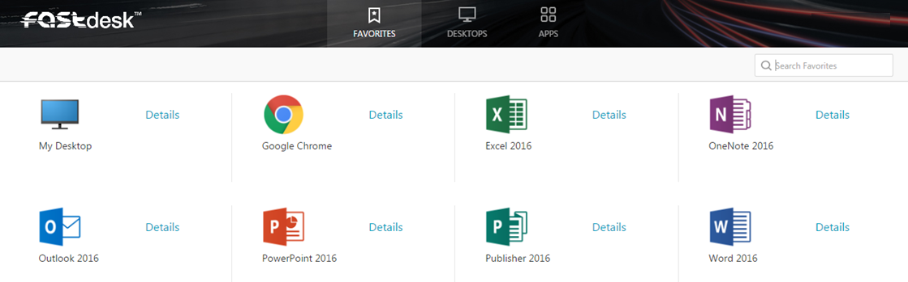

# How can I reset my FASTdesk password?

Your FASTdesk password will expire every 6 weeks and you will be prompted to change it when you log in. Upon expiry you should see a
screen similar to the one below.

Here, you need to enter a password which matches the FASTdesk password requirements. For security purposes, passwords must be 8
characters or longer and include mixed case and at least one number.

You’ll then be asked to confirm this password. If the passwords that you entered correctly matched you will be logged in
successfully and you’ll see a screen similar to the below.

If you have forgotten your password and would it like to be reset, this is something that can only be done by FASTdesk Support. In order to reset your password, you can email support@ukfast.co.uk, create a ticket via https://my.ukfast.co.uk/pss/add.php or ring our FASTdesk Support Line directly on 0800 923 0617.
