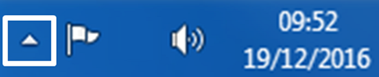
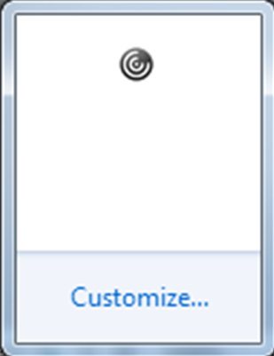

# I can't see my local drives and devices in FASTdesk, how can I resolve this?

Sometimes you may wish to access your local peripherals such as webcams, microphones, printers, and scanners and use them within your Desktop session. However, you may encounter an issue where you cannot see any of these devices.

Often, this can be due to the fact that these devices have not been connected to the virtual session. Upon first logon, you will be asked whether FASTdesk can access your local devices and map them to the FASTdesk session. Often, clicking no to this notification is the reason that you will not be able to see your local peripherals.

To resolve this issue, you can change your Citrix Receiver preferences so that your devices can be recognised. Firstly, make sure that you have a desktop session open. Then, navigate to your local desktop and locate the system tray in the bottom right-hand corner of your screen and click the small triangle up arrow.

You’ll then see a variety of icons appear. To navigate to the Citrix Receiver preferences we need to right click the Citrix Receiver icon which you can see below.

You’ll then see a few options appear. Here, you want to choose ‘Connection Center’.

On the following screen, you’ll be able to see your current connected session. Left-click ‘My Desktop – Citrix Receiver’ and then left-click ‘Preferences’.

Here, you’ll be able to adjust what drives and devices are passed through to your FASTdesk session. As you can see below, you can restrict access to your local drives. This varies from read and write access to files to restricting access completely so that you can’t even see the files which are stored on the drive.

Also, you can change to the ‘Connections’ tab to change which devices are passed through to your FASTdesk session. As you can see below, you can change the session settings for microphones and webcams and digital cameras and scanners.

‘Connect automatically’ will ensure that the devices are automatically recognised.

‘Do not connect’ will prevent the devices from being recognised.

‘Ask me’ will prompt you when a device is going to be used.

Once you have made the necessary changes, click ‘Apply’ and then ‘OK’ to save your changes.

