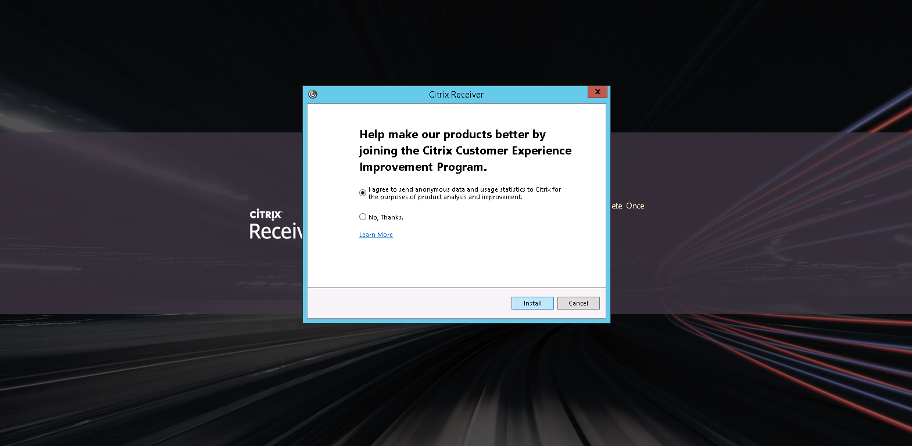
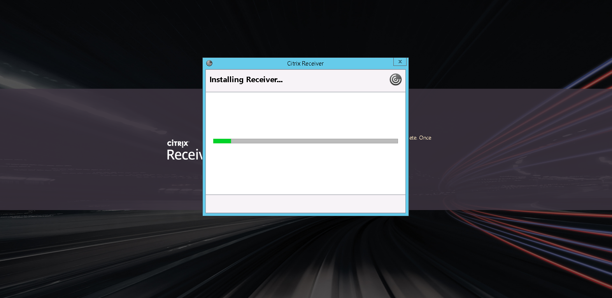
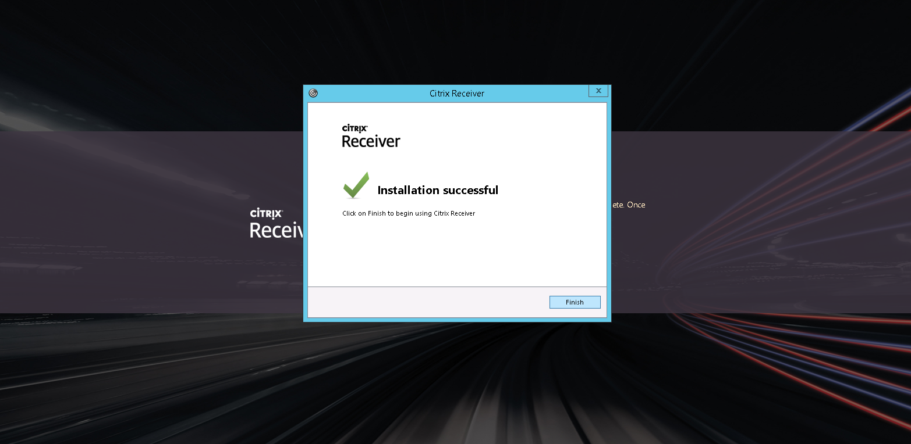

# Installing and Configuring Citrix Receiver

## Downloading Citrix Receiver

Navigate to the [FASTdesk web application](https://daas.ecloud.co.uk) and login using the credentials you have been given. Your username should be something like `yourname@companyname.fastdesk`

Once you've logged in, you will be prompted to change your password. For security purposes, passwords must be 8 characters or longer and include mixed case and at least one number.

Another screen will then appear. Here, click the __Detect Receiver__ button. This detects whether Citrix Receiver is already installed on your device.

If Citrix Receiver is already installed, you should see a notification appear similar to the below. Here, click __Open Citrix Receiver Launcher__.

However, if you don't have Citrix Receiver installed then you will need to install the application in order to proceed further. Read and agree to the Citrix license agreement and click the __Download__ button in order to this.

Once you have clicked __Download__, you will be able to see the progress of the file which is being downloaded in your browser. Once downloaded, left-click the download to start the install.

Installing Citrix Receiver is done in a few simple steps. You'll initially see the following screen:

If you're happy with what you have read above, click __Start__.

You'll then be asked to read through another license agreement. If you're happy with this, check the tick box and click __Next__.

You'll then see a screen asking if you wish to send anonymous data and usage statistics to Citrix. Feel free to check the __No, Thanks__ box if you wish.

Citrix Receiver will then begin to install.

Once Citrix Receiver has fully installed you'll see the following

You should then be reverted back to the screen below

Now that Citrix Receiver has been downloaded and installed, you can click __Continue__ here

## Installing Citrix Receiver

Run the Citrix Receiver file and go through the installation wizard

Launch Citrix Receiver from your program menu

## Configuring Citrix Receiver

Enter __daas.ecloud.co.uk__ when prompted to __Add Account__

Enter your username and password
