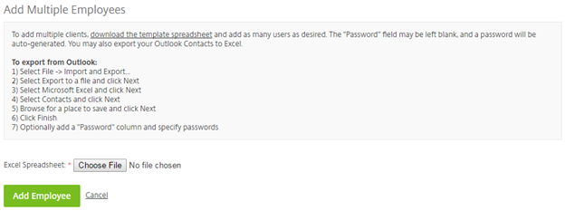
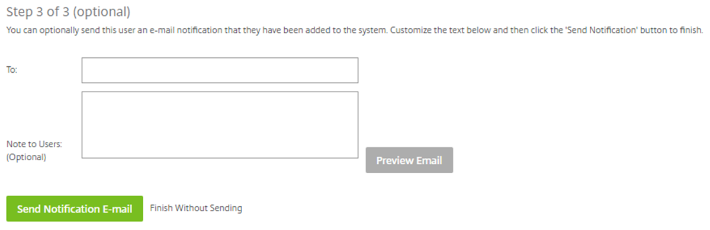

# Adding an employee from an Excel spreadsheet

Alternatively, multiple employees can be added through an Excel spreadsheet to speed up the process. To do this, again navigate to ‘People’ and then ‘Browse Employees’. Click ‘Create Employee’ as normal and you will see this button:

The following screen will then appear. There is a link to a template spreadsheet which shows how the spreadsheet needs to be structured before being uploaded. The below image also contains instructions on how to export from Outlook.

If you copy the headers into your own spreadsheet you can then input your own data. Note: The headers must not have spaces in between words and the company field doesn’t have to be filled in. The password field can also be left blank if preferred and a password will be automatically chosen.

Click ‘Choose File’ then upload your Excel file. Once uploaded you should see a screen like the one below.

You will need to provide the user with some basic user permissions. 'Select storage zone for root-level folders' will be set as unticked by default because this is automatically set to our storage zone. Also, 'Create root-level folders', 'Use personal File Box', 'Manage client users', and 'Edit the shared address book' will be set as ticked by default. However, the admin user can choose whether the employee user can change his/her password and whether they can see the 'My Settings' link on the top navigation bar. Furthermore, you can also choose whether to add this user to the shared company address book and the address book from which you are creating the account.

We recommend that ‘Add this user to the shared company address book’ is ticked. This is so that the user can be seen by other users on the platform and share files with them.

The following describes the permissions and what they do:

Create-root-level folders – This will give a user permission to create top level folders.

Use personal File Box – This will give a user permission to use their file box.

Manage client users – This will give the user permission to add client users.

Edit the shared address book – This will give user’s permission to edit the users within the shared address book.

Change his/her password – This will give the user permission to change their password.

See the ‘My Settings’ link on the top navigation bar – This will allow the user to see this button.

Add this user to the shared company address book – This will add the user to the shared address book which is seen by all employee users.

Add this user to my address book – This will add the user to your personal address book but not to other users address books.

Once permissions have been set, you will have the option to send out confirmation emails. This lets the user know that they have been added as a user.
