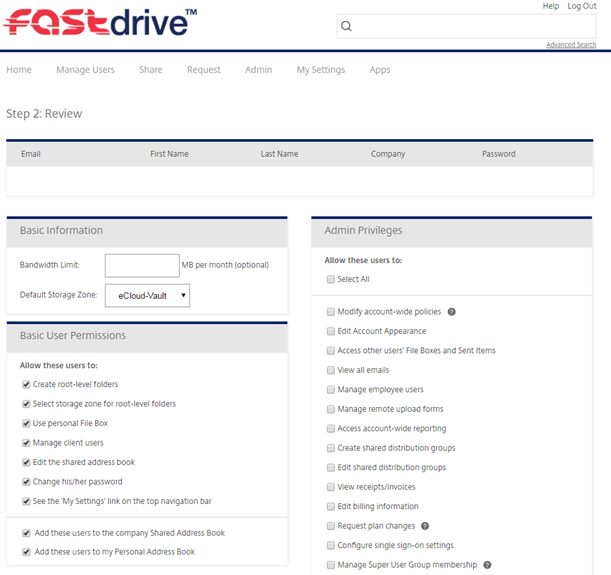

# Adding an employee from an Excel spreadsheet
Alternatively, multiple employees can be added through an Excel spreadsheet to speed up the process. You will see this button:

The following screen will then appear. There is a link to a template spreadsheet which shows how the spreadsheet needs to be structured before being uploaded. The below image also contains instructions on how to export from Outlook.

If you copy the headers into your own spreadsheet you can then input your own data. Note: The headers must not have spaces in between words and the company field doesn’t have to be filled in. The password field can also be left blank if preferred and a password will be automatically chosen.

Click ‘Choose File’ then upload your Excel file. Once uploaded you should see a screen like the one below.

You can then set basic user permissions and admin privileges as described in the previous section on Adding Employees manually.

