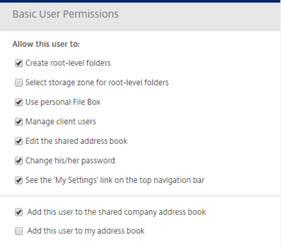
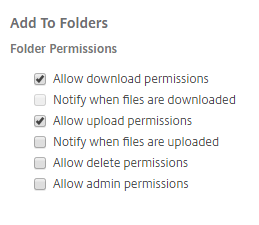
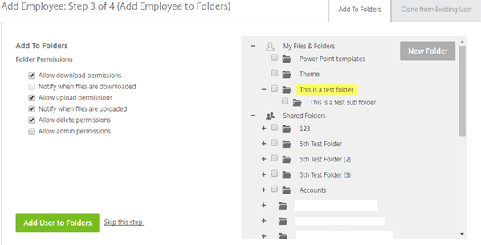
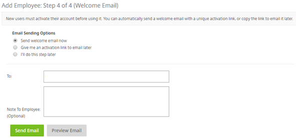

# Adding an Employee

## Step 1

Firstly, you will need to provide the user’s email address, which will be used as their username for logging into FASTdrive.

## Step 2

This part of setting up employees can sometimes be quite complicated so we have split it into sections. Firstly, you will need to fill in the basic details such as Name, Company. The password field will be automatically filled in as you can see below.

You will also need to provide the user with some basic user permissions. Note: The lists of basic user permissions are subject to change.   We recommend unticking the box ‘Select storage zone for root-level folders’ but leaving every other basic user permission ticked up to and including ‘See the ‘My Settings’ link on the top navigation bar’. You will also be able to see two more options below this which, if ticked mean that the user will be added to the shared company address book and the FASTdrive Support personal address book for your account. We recommend that ‘Add this user in my address book’ is unticked. This is because we recommend adding the user to the shared company address book so any user can share folders with that user rather than just yourself.

Create-root-level folders – This will give users permission to create main folders that can be used. 

User personal File Box – This will give user’s permission to user their file box. 

Manage client users – This will give the user permission to manage the permissions and settings of client users. 

Edit the shared address book – This will give user’s permission to edit the users within the shared address book. 

Change his/her password – This will give the user permission to change their password. 

See the ‘My Settings’ link on the top navigation bar – This will allow the user to see this button.

Add this user to the shared company address book – This will add the user to this address book. This means that the user can be selected to view shared folders. 

Add this user to my address book – This will add the user to your personal address book but not to other users address books.

The final part of step 2 is setting up admin privileges. For a regular employee account, no Admin Privileges are usually ticked unless of course, you wish to delegate certain privileges to employees.

Here is an explanation for some of the admin privileges:

Modify account-wide policies – This allows the user to edit the account name, subdomains, account wide preferences and power tools access. 

Manage remote upload forms – This will allow users to manage remote upload forms. These are forms which allow visitors to upload files directly to FASTdrive without the need for a username or password. 

Access account-wide reporting – This will allow users to have access to all reporting across the account. 

Request plan changes – This allows the user to request changes to the plan level including cancellation of the account. 

Configure single sign-on settings – This allows the user to configure single sign on-settings so extra credentials are not needed when trying to access some features of FASTdrive e.g. Admin password required. 

Manage Super User Group membership – This user will be allowed to add and remove employee users to the Super User Group and select whether to hide the group from the folder access listings. 

Delegate admin privileges to other employee users – This user will be allowed to manage other employees’ access to the roles of which this user currently has access (Requires being able to manage employee users).

## Step 3

Next you can choose to add employee users to folders. This is used to enable shared folders which employees can access to view documents as well as having their own personal folders. Additional folders can be created for the user at this point by clicking the ‘New Folder button.

The employee you have created will automatically have the 3 folders above. You can add the employee to folders by simply clicking the + icon on the left of the folder. From here you will be presented with more folders.

To add employees, tick the box on the left of these folders and click the ‘Add User to Folders & Groups’ button. Clicking this button will take you to the next step so we advise that you only click this button once you have chosen everything you need to on the page. You will be able to edit folders and folder permissions for employees after the initial setup has been completed, so don’t worry if you forgot to add an employee to a specific folder.

During this stage you can also set up Folder Permissions for users, this is located on the left hand side of the page. The basic permissions we recommend are ‘Allow download permissions’ and ‘Allow upload permissions’. Of course you can tick the other boxes for employees should you wish to give them more permission. Additional admin users can be created here by ticking ‘Allow admin permissions’.

Currently, you can’t set different permissions for different folders from this view. However, you can do this by navigating to each specific folder and adjusting the permissions.

You can also clone permissions from existing users to potentially save time. This may be useful if for example, you have 2 people that work in the same department and perform the same role. If you’ve set one of the two users’ accounts up you can just clone the other rather than recreating it. If you are going to clone folder access make sure that you click ‘verify email’ just to check that the current user exists.

Add the folder permissions and you should see the following.

## Step 4

The final step is to send a welcome email to the new employee user. Before they use the account, users need to activate it by clicking the activation link in the email.

