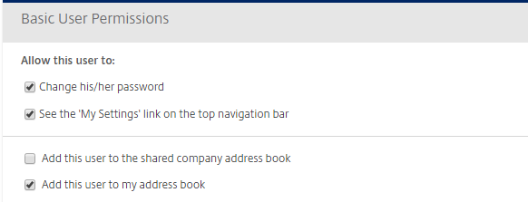

# Adding Clients

Adding Clients to FASTdrive can also be done by the administrator. This can be useful if you wish to have an end user account that a client can use to share files and collaborate with your employees.

## Step 1

This is exactly the same as it is for setting up employee accounts.

## Step 2

The majority of this step is exactly the same as setting up an account for an employee user, the key difference being that their basic user permissions are far more limited. Below are the basic permissions that can be set for a client user. It is up to you whether you ‘Add this user to the shared company address book’ however, we do recommend that the top 2 boxes are ticked to allow the client user to control some of their settings and allow them to change their password.

## Step 3

Again, this step is exactly the same as it is for creating employee users.

## Step 4

This step is exactly the same as it is for creating employee users.
