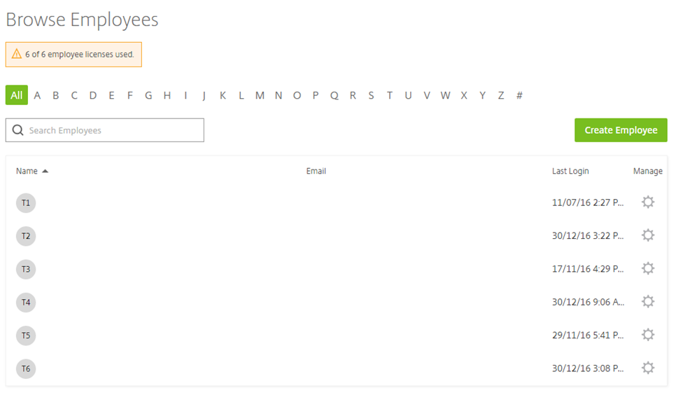
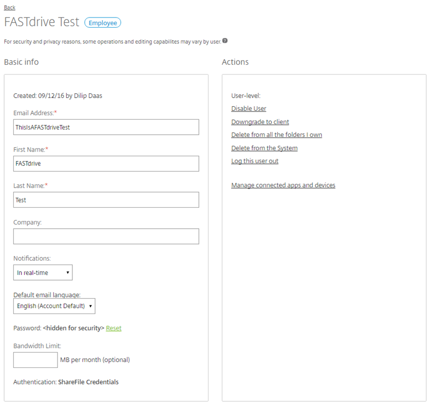
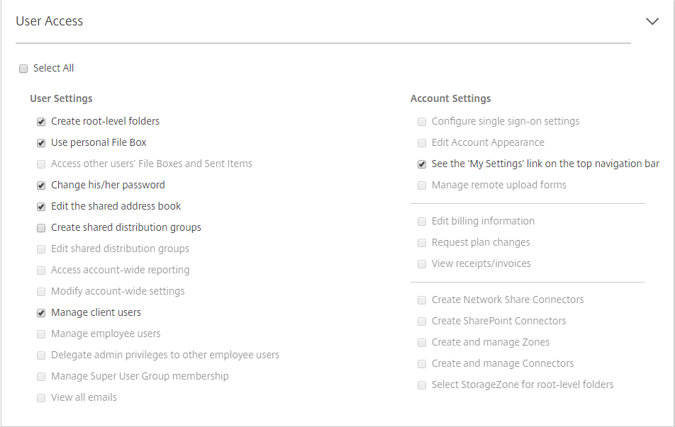

# Browsing and Managing Employees

The admin user can find other employee users on FASTdrive by navigating to the ‘People’ tab and clicking ‘Browse Employees’.

Here, you’ll be able to see the amount of licenses which you have and how many are being used and also the list of employee users associated with your account.

You can manage an employee by clicking the cog icon next to their name. Pressing this will bring up the following view:

In the above view you can see basic data about the user such as their email address which they use to log into FASTdrive and their name. On the right-hand side you can see various user-level actions which you can initiate. Below, these are explained in more detail.

Disable User – This will disable the user and make the account inactive until it is reactivated.

Downgrade to client – This will remove the account as an employee user and turn it into a client user. Any files or groups owned by the employee will also need to be assigned to another user unless you would like to delete these files and groups permanently.

Delete from all the folders I own – This will remove the specified user from any folders which you are marked as the owner of.

Delete from the system – This will remove the account from the system completely. Similarly to when you are downgrading an employee user to a client user, you will be prompted to assign any files and groups owned by the user to another user unless you would like to delete these files and groups permanently.

Log this user out – This will log the user out of all of their active sessions, whether that is the Drive Mapper application or the web app.

You can also change some of the user’s permissions by expanding the ‘User Access’ tab.

You won’t be able to adjust all permissions but you will be able to enable or disable some such as ‘Manage client users’ and ‘Create shared distribution groups’.

