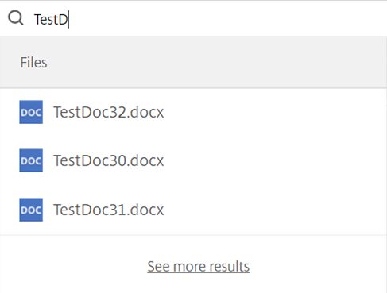
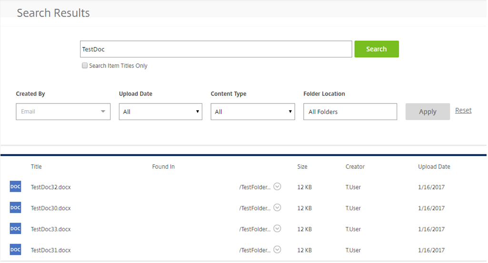

# Is there a way I can browse for a specific file or folder?

You may encounter an issue where you can't find one of your files or folders. This may be because you haven't accessed it for a while and
can't remember exactly where it is located.

If this is the case, you can directly search for a file or folder using the search function.

## Searching for files in the FASTdrive web app

At the top of every page you will search a small magnifying glass. Clicking this icon will expand the search box.

In this box, enter the name of the file or folder that you'd like to search for. You don't have to enter the full name of the file or
folder here as the search will bring up all results containing the consecutive character that you have entered.

In this instance I have entered __TestDoc__ into the search bar and as you can see, a variety of files have appeared which match the string of text that I entered.

If you hover over one particular file or folder, you'll be able to see a few shortcuts which are related to the file or folder. From here, you can directly navigate to a file, share a file, or download a file.

Likewise, you can also navigate directly to a folder from this view.

If the file or folder that you are looking for doesn't appear whilst you are searching, hit the __enter__ key to perform a full search. This will perform a search on all the files and folders that you have permission to and will bring up anything that matches your search.

