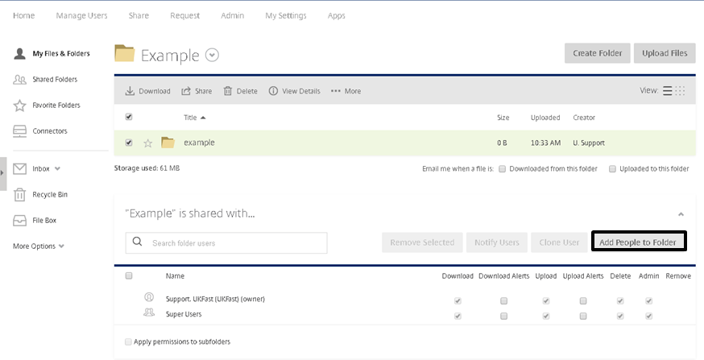

#Creating Folders within FASTdrive

You can create folders in two different ways, the first is to create the folder from the FASTdrive web application as shown in the image below.

For this, you will need to be in the folder you want to create the new folder in. Once you are in the correct location press the Create Folder button.

A pop up will appear and ask you for the name and a description; this description is optional.  

The Add Users tick box allows you to add people who are also using your company’s FASTdrive – typically other employees or clients.

If you are using ShareFile Drive Mapper, then you will need to navigate to the location that you want to create your new folder in. Right click in the location you want the folder and go to “New” -> “folder” . You will then need to give it a name; when creating folders using ShareFile Drive Mapper, you are unable to give permission for other users to access it.

However, if you do want to give permission for others to access the folder then you will need find the folder on the web application. Click on the folder,  navigate  to the bottom right hand corner and ‘Add People to Folder’.

