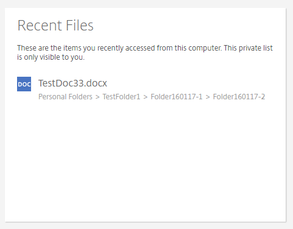

# Navigating the dashboard

The FASTdrive web application dashboard contains your recent files, shortcuts, tutorials, and helpful links all in one place.

## Recent Files

Files that you have recently accessed will be shown here.

Once you have opened a particular file, it will be shown here.

Showing the files that you have recently accessed allows you to easily access them.

## Shortcuts

A variety of shortcuts are available on the FASTdrive home screen. These allow you to jump to certain areas of the web application quickly.
