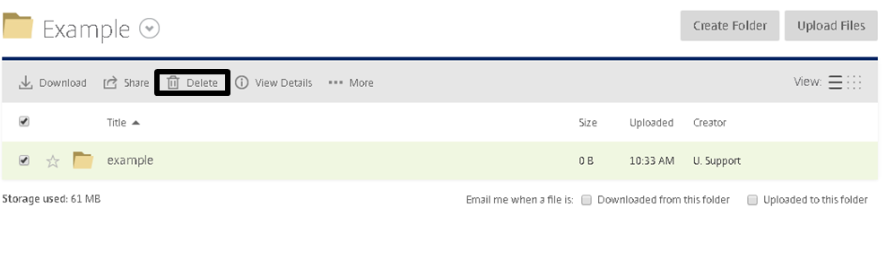

#Deleting Files and Folders

So you now know how to upload files and create new folders, but what if you want to delete these items.

You will need to highlight the item you want to delete by checking the tick box and then click the Delete button. You will not be able to delete items if you do not have permission to do so. Don’t worry if you delete something by mistake, we keep all files up to 30 days after being deleted in the recycling bin, so you can access and recover them.

To restore a file from the Recycle Bin, just check the tick box of the file  and then click Restore. Alternatively, if you want to permanently delete a file, you can click on the Delete Permanently button. However, we will not be able to retrieve file this if you do delete it permanently.

