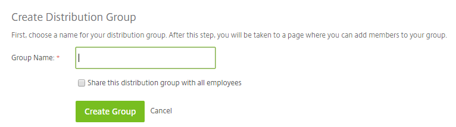

# Distribution Groups

Distribution Groups can be created by the administrator in order share files and folders with a certain group of people in one go, rather than manually selecting them. This can be done by navigating to 'Manage Users' and selecting 'Distribution Groups'.

From here you can either create a ‘New Group’ or ‘Delete Selected’ groups if you need to remove them.

Selecting ‘New Group’ will allow you to create a Distribution Group along with the option to share the group with all employees.

