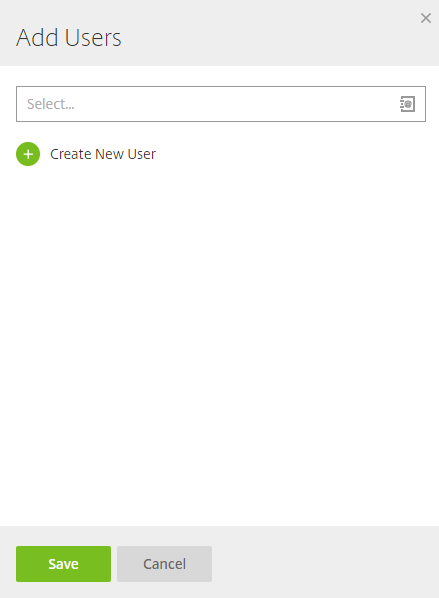
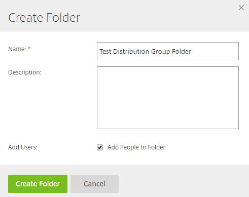

# Distribution Groups

Distribution groups can be created in order to share files and folders with a certain group of people quickly. Instead of assigning individual users to a folder, a distribution group can be used instead.

Admin users can create distribution groups and if they’re assigned the ‘Create shared distribution groups’ permission, normal employee users can do so too.

To create a distribution group, navigate to the ‘People’ tab and find ‘Distribution Groups’.

To create a new distribution group, click ‘New Group’.

You’ll then be asked to give the distribution group a name. After this you’ll be prompted to add members to the distribution group. You can also choose to share the distribution group with all employees on the system.

To add a user to the distribution group, click ‘Add New User’. You can either search for a user who is already a user on the system, or you can create a new user to add to the distribution group.

As you can see below I have added 2 test users to the distribution group.

This means that I can create a folder and add the distribution group as users to the folder. Below I have created a folder called ‘Test Distribution Group Folder’ and I have ticked the ‘Add People to Folder’ check box.

I have then added the ‘Test Distribution Group’ which contains the 2 users that I created previously.

I then added permissions to the folder. These folder permissions will apply to all of the users in the distribution group.

Below, you can see the users that are included on the folder. ‘Test Distribution Group’ has been added to the folder meaning that the 2 users in ‘Test Distribution Group’ have access to this folder with the permissions shown below.

