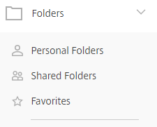

# Downloading Files

Files can be downloaded from FASTdrive in order to be used locally. Firstly, navigate to the folder where the file that you’d like to download is situated.

To find the folder using the web app, navigate to __Folders__ which you can see in the left-hand menu. You’ll then be prompted to select either __Personal Folders__, __Shared Folders__, or __Favorites__ and the file which you are looking for will be in one of these folders.

Once you have found where your file is located, you need to left-click the file name.

Completing this action will bring up a variety of options. However, in this instance we’re looking at how to download the document. On the right-hand side amongst the other options you’ll be able to see a button named __Download__. Clicking this will download the document.

Once you’ve hit the __Download__ icon, at the bottom of your screen you should see that the file is downloading or already has been downloaded. Left click the file in order to open the document locally.

