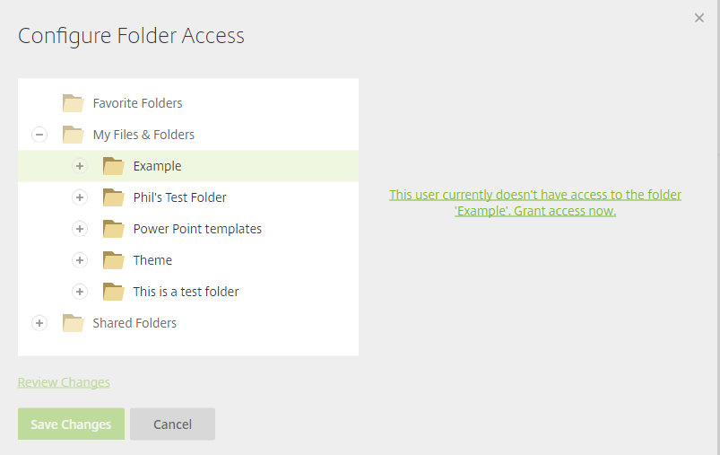
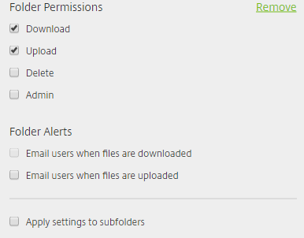

# Folder Permissions for Users

Folder permissions for employee users can also be configured here if you forgot to do this step in the initial setup or need change employees’ permissions. These settings can be found at the bottom of this page.

When you click on ‘Configure folder access permissions for this user’ you will be presented with the following screen.

To grant user permissions to a folder, click on the chosen folder and select ‘This user currently doesn’t have access to the folder ‘folder name’. Grant access now’. This will then present you with the following folder permissions, which you can grant to the employee.

Selecting the ‘Clone folder access permissions for this user’ option will present you with the following page: 

From here you can enter the email address of an existing user, and the user you are editing will be given the same folder permissions.

Editing clients follows the same process, the only difference being that ‘Admin Privileges’ are not available for clients.  There is also the option of upgrading the user to an employee.
