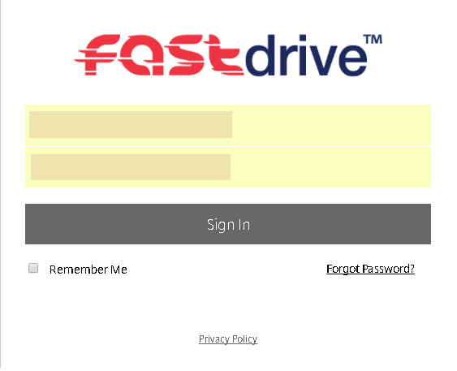
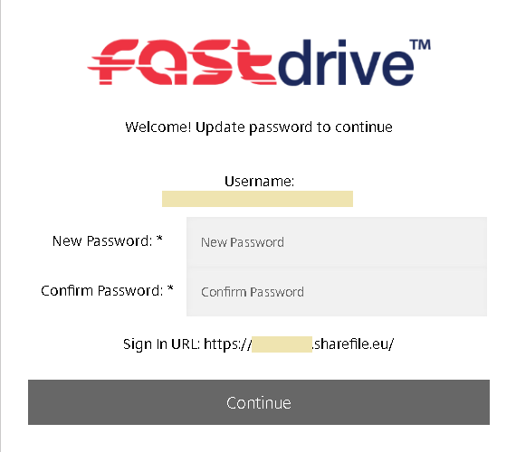

# Logging into FASTdrive

Before we get started you will need to have your FASTdrive login credentials ready, this will include your username and a temporary one-time use password.  You will also have been supplied with a unique URL for your FASTdrive login.

Once you have opened the FASTdrive web application, you will be presented with a login screen.

You will be asked to create a new password after successfully logging in.

