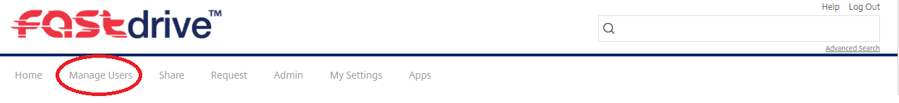

#Managing Users

As an administrator, you have the permissions and access to manage users related to the FASTDrive account. This can be done by navigating to the ‘Manage Users’ tab at the top of the FASTdrive page.

There is a list of options on the left hand side of the page, the first of which you will be automatically directed to is ‘Manage Users Home’. From this page, you can create users, both as employees or as clients. 
