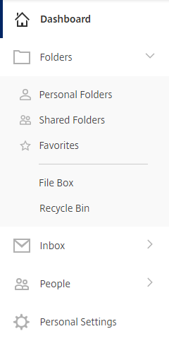

# The FASTdrive recycle bin

The FASTdrive recycle bin contains files and folders that have been deleted from your account. Files that have been deleted and therefore
moved to the recycle bin will stay there for a maximum of 45 days. It's not possible to recover a file 45 days after it was originally
deleted and if you permanantly delete a file from the recycle bin before the end of this 45 day period, it cannot be recovered.

To access your recycle bin, expand the __Folders__ section of your left hand menu. Here, you'll see a link named __Recycle Bin__

## Folder recycle bins

Each folder has a recycle bin which will show your recently deleted items.
