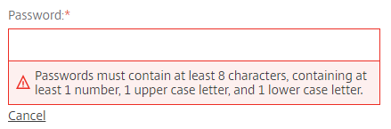
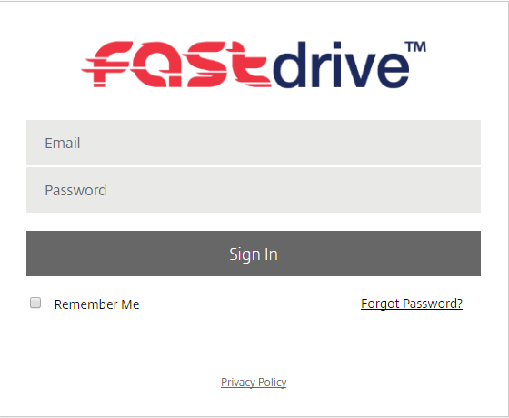
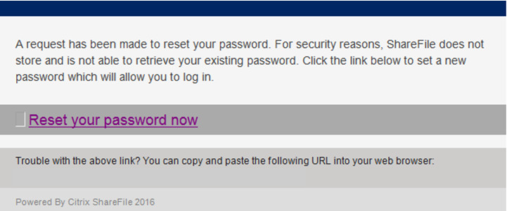
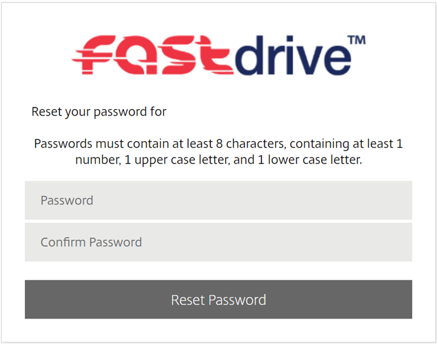
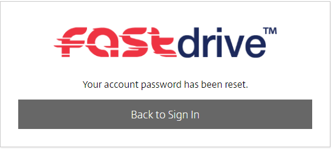

# Resetting Passwords

## Resetting employee user passwords as the Admin user

The admin user can reset the password of any employee user. To do this, navigate to the ‘People’ tab and click ‘Browse Employees’.

Here, you will see all of the employee users which are on the platform. Select the employee user whose password you’d like to reset by marking the tick box as shown below and then left clicking their name.

From here you’ll be able to see the ‘Basic info’ section and within the section is an option to reset the user’s password.

By clicking reset, you will be able to enter a password for the user and you’ll see the password requirements that you need to adhere to.

Once you’ve entered the password, hit the ‘Save Changes’ button to change the password.

Once the password has been changed and the user can log in, they can then change the password to something of their choice. To do this, the user needs to click ‘Personal Settings’ on the left-hand menu.

The user wants to then click ‘Edit Profile’ on the following page.

If the user scrolls down the page, they’ll be able to see a ‘Change Password’ header. Under this, the user needs to enter their current password and their new password twice. Once the user has entered their password they should click ‘Save’. As long as the password meets the necessary requirements, it will be changed.

## Resetting your own password as a normal employee user

Employee users can reset their own passwords as long as the ‘Change his/her password’ permission is selected under ‘User Access’.

Firstly, the user needs to navigate to the left-hand menu and click ‘Personal Settings’.

The user wants to then click ‘Edit Profile’ on the following page.

If the user scrolls down the page, they’ll be able to see a ‘Change Password’ header. Under this, the user needs to enter their current password and their new password twice. Once the user has entered their password they should click ‘Save’. As long as the password meets the necessary requirements, it will be changed.

If you have forgotten your password, you won’t be able to follow the above method. Instead, you can follow the method below.

Firstly, navigate to the web app log in screen. This should look similar to the below.

You will be able to see a ‘Forgot Password?’ link. Click this link and the following screen will appear. Enter your email address and select the specified icon and click ‘Send’.

You’ll then be notified that an email has been sent to your registered email address.

You’ll see an email in your inbox similar to the one below. Click ‘Reset your password now’.

You will then be directed to a screen similar to the one below. Here, enter the new password twice and click ‘Reset Password’.

You will then be notified that the password has been reset successfully. Click ‘Back to Sign in’ and enter your new credentials.

