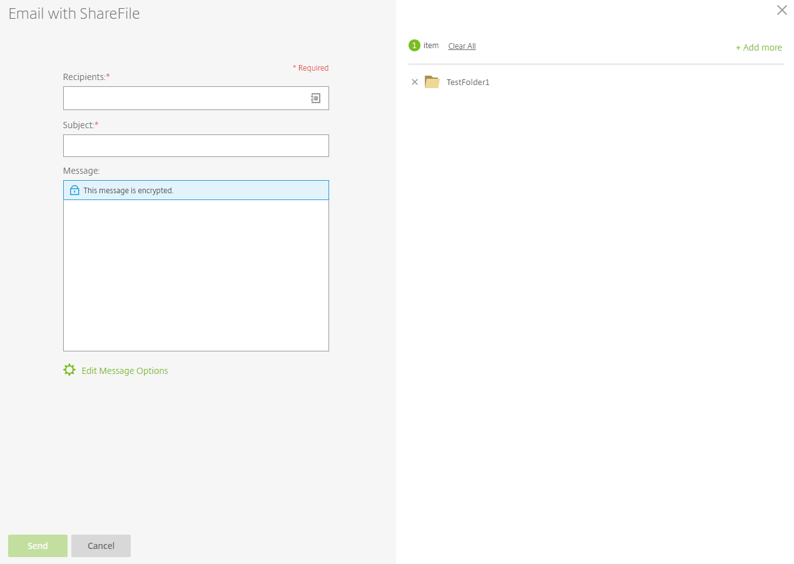

# Sharing files

In FASTdrive, you can share files and folders so that other people can access them. You can share files and folders with both FASTdrive users and non-FASTdrive users via the sharing feature that is available within FASTdrive.

In order to share a file with someone else, firstly navigate to that file within the FASTdrive web app. In this instance I have delved into my personal folder so that I can share a folder named __TestFolder1__.

To the left of the folder name, there is a checkbox so that you can select this folder. Tick this box and you will see the variety of options that are available to you. In this instance, we want to share this file, so click the __share__ button.

Two options will then appear; __Email with ShareFile__ and __Get a Link__. These are two different ways of sharing files.

Firstly, we'll go through __Email with ShareFile__.

Once you've clicked __Email with ShareFile__, you'll see the following screen.

As you can see, the folder that you initially shared is shown in the top right-hand corner of the screen. On the left, you need to enter the __Recipients__ of the message, the __Subject__ of the message, and if you like you can add an additional __Message__.

Firstly, we need to choose who we are going to send the message to. In the recipients field, there is a small icon as you can see below.

__For more information on how to add contacts to your address books and distribution groups, take a look at the following pages:

[Distribution Groups](https://docs.ukfast.co.uk/fastdrive/distributiongroups.html)

[Address Books](https://docs.ukfast.co.uk/fastdrive/addressbooks.html)
__

If you click this your address book will open. This will contain all of the contacts that have been added to either your Personal Address Book, Shared Address Book, or one of your Distribution Groups.
