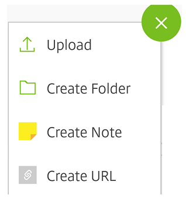
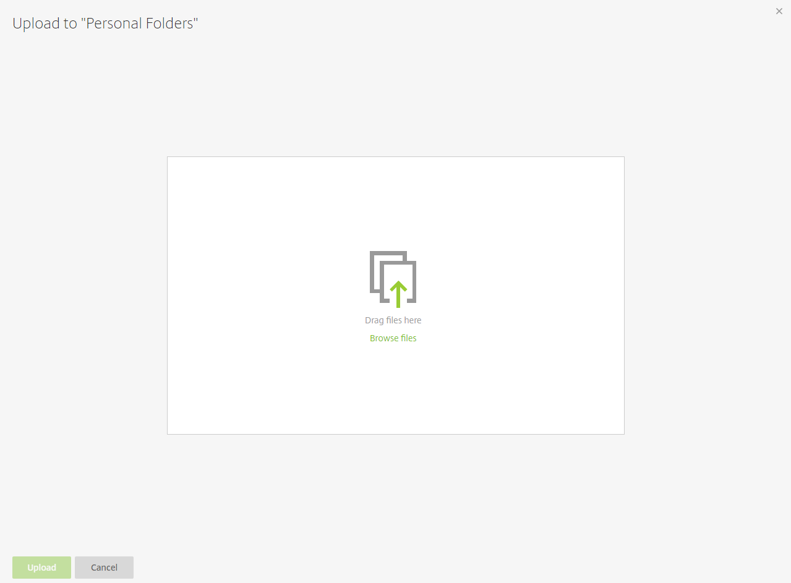

# Uploading Files

## Uploading files to your personal folders

All users can upload files to their ‘Personal Folders’ section which they can use for their own use. Providing the user has the correct permissions, they can also upload files to folders situated under ‘Shared Folders’.

Firstly, we’ll upload a file to our ‘Personal Folders’. You’ll be able to see a green circular icon in the top right-hand corner of your screen.

If you hover over this icon you will see a variety of actions which you can undertake. In this instance we’re going to upload a file so hit the ‘Upload’ button.

You’ll then see the following screen. Here, you want to click ‘Browse files’ so that you can look for a file to upload.

Browse your computer in order to find the file(s) that you want to upload. In the instance below, I have uploaded 2 files. You can choose multiple files by holding down ‘CTRL’ on your keyboard.

Once you’ve chosen the files that you’d like to upload, press the ‘Upload’ button.

As you can see above, the files have been uploaded to your ‘Personal Folders’.

## Uploading files to your shared folders

As you can guess from the name, shared folders are folders which other users have access to as well as yourself.

You won’t always have the correct permissions to upload to some shared folders. If the user who has set the permissions has not given you the ‘Upload’ permission, you’ll be prevented from uploading files to here. As you can see from the screenshot below, there is no option to upload.

The process of uploading to shared folders is exactly the same as uploading to your personal folder. The difference is that other users will be able to see, upload or download files in this folder.
