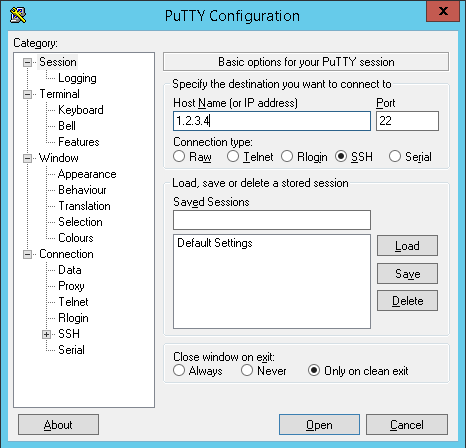

# Accessing a server over SSH

## Via a terminal

The simplest way to access a server via SSH is from a local terminal, be this from Linux, Mac etc.

The below command will access the server with IP 1.2.3.4, using the root user and over port 2222. The default SSH port is 22, if using this port it does not need to be specified. Further flags are detailed in the man pages, accessible via the command "man ssh".

```console
ssh root@1.2.3.4 -p2222
```

Presuming all goes well, you should be prompted for a password to the remote server. Enter this correctly and you're in. If you have connection issues, ensure that the port you are connecting over is open both outbound from your local firewall, and inbound on the remote firewall.


## Via Putty

If you're operating a local machine on Windows, Putty is probably the best option. Download the appropriate version for your machine (probably the first one) from the following URL.

```console
http://www.chiark.greenend.org.uk/~sgtatham/putty/latest.html
```

Once downloaded and installed, you should see a screen similar to the below upon opening Putty. Simply enter the remote IP address (or hostname, as long as it resolves to the correct IP) in the Host Name field, and the port in the Port field and hit Open.



If the connection is successful, the remote server should prompt for a username, and then password. Enter these correctly and you're in. If you have connection issues, check your local and remote firewall configurations.
