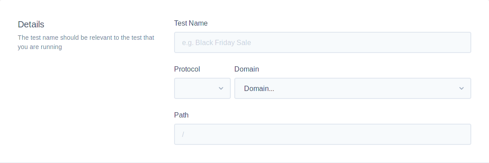
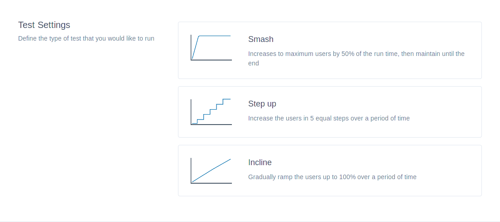
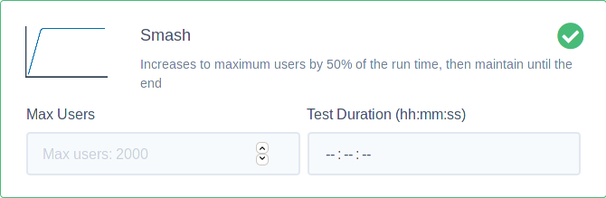

# Create A Test

Creating a test is relatively easy, deciding what to test is less so. If you haven't decided what to test yet, go and read [guidance on this](/ltaas/guidance/index), since that is a pre-requisite to creating a test. If you have decided what to test, then read-on to understand how to create a test.

## Test Details

First head over to the "Create a Test" page. You can get there from the domains page, or alternatively from the tests page. You should be greated with the following section first.



```eval_rst
.. note::
   If you clicked "Create a new test" from the domain screen, you'll have the domain auto-selected and won't be able to change it.
```

The first step is to fill in the `Test Name`. This will be visible in the test table, so be descriptive if you plan on running tests regularly so you know what has run and when.

Next select the `protocol`. If you're not sure what the protocol is, in your browser navigate to the website. You may be redirected to the secure (https) version of your site. If that's the case, you should select https, otherwise the redirects will cause your test to fail. If you site has a certificate installed you should always select https. If you don't have a certificate installed, select http.

The next field is `Domain`. Drop down from the list. If you have a few domains here, select the one you wish to test. If you have just the one, your selection is much easier.

The last field on the details form is the `path`. Putting the path as / will mean the traffic will likely be hitting your homepage. If you have an alternative homepage and wished to test that, you could enter /home, if /home was your homepage. A good rule of thumb to use is to enter whatever is in your browsers url bar (minus the protocol and domain).

## Test Settings

The test settings section will allow you to configure the behaviour of the test. You have the three following choices:

- **Smash**
  This test style will ramp up to your choice of users over 50% of the test duration, then it will plateau. For example if you had 50 users over a minute, at 0 seconds it would be 0 users, at 15 seconds it would be at 25 users and at 30 seconds it would be at 50 users. The ramp would be linear. This test type is good for causing a quick amount of traffic and testing if the server can sustain it at the max users.

- **Step Up**
  This test style will increase the number of users in equal increments over 5 steps. For example 50 users over a minute would add 10 users every 12 seconds. This type of test is similar to smash, but is a more aggressive ramp-up. It's good for catching configuration issues where quick increases in traffic can result in loss of available servers to handle requests.

- **Incline**
  This test style will ramp up the amount of users to the maximum specified over a period of time. For example if you had 60 users over a minute, every second a new user would be added to the test. This is a good initial test to determine whereabouts your maximum capacity is and to understand the latencies involved.



```eval_rst
.. note::
   We recommend starting with the **Incline** test type to initially determine capacity. From there **Smash** can help determine general configuration issues. Once you've weeded out general issues, the **Step Up** over a reasonable amount of time can be
   used to catch traffic variability issues.
```

Each test type alows you to input the maximum amount of users you want to test with. We recommend you review any analytics tools you may have to determine a good starting point. Ensure that you don't over-extend too early and immediately bringing your site offline. The maximum amount of users is **2000**. Test duration does allow hours, however most people only test for a couple of minutes. It's good to keep test short to iterate your settings and reduce impact of tests. If you want to test scaling during a test, then you may want to consider a longer test to account for scaling.



## Schedule

The schedule section lets you either run the test now, later at a specified time and date, or on a repeating schedule.

If you want to quickly run a test, just select the `Run now` option and then click the Run now button. You should be sent to the test screen where you will see your test available.

If you'd like to run a test at a different time, for example out of business hours, then you have the option to do that. Tick the `Schedule` option and fill in the two fields. It will ask for a date and a time.

```eval_rst
.. note::
   The schedule system will likely not execute at the exact time entered, but will execute at a time very close to it. This is to ensure resources aren't execessive at common time schedules.
```

Lastly, both Run Now and Schedule offer the ability to `Repeat` the test. This is a good feature if you regularly develop your site and want more confidence in your solutions ability to cope with the traffic levels you expect, both at a software and hardware level. All you need to do is tick the Repeat option and enter a quantity and a frequency. For example, entering a quantity of 7 and a Frequency of Days, would mean the test runs every 7 days. You could achieve the same by entering a quantity of 1 and a Frequency of weeks.

```eval_rst
   .. title:: Creating a new Load Test
   .. meta::
     :title: Creating a new Load Test | UKFast Documentation
     :description: How to create a new load test
     :keywords: load, test, testing, loadtest, load-test, create
```
