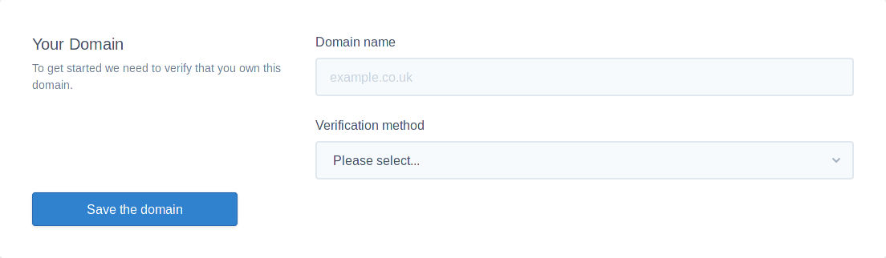
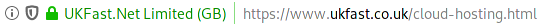

# Domain Setup

When first using the UKFast loadtesting service, you'll be prompted with the same screen
as when you manually add a new domain in future. To get started, only two pieces of
information are required: `Domain Name`, `Verification Method`



## Domain Name

The domain name is the part of the URL (The bar at the top of your browser) which is
after the protocol `http(s)://` and before the first `/` following the protocol.



In this screenshot, the URL contains `https://www.ukfast.co.uk/cloud-hosting.html`,
so if we remove the protocol (https in this case), we're left with
`www.ukfast.co.uk/cloud-hosting.html`. However this is still not our domain as we still
have a document in there (Everything following and including the `/`). If we remove
the document from the URL we're left with `www.ukfast.co.uk`.

For the tech savvy, you'll notice that `www` has been included in the domain. This
may be a requirement for you, but don't presume that you need to add a subdomain such
as www in there. You should visit your site in the browser and if it redirects to
www, include it, if it doesn't then there's no need to include it. Ultimately you
should rely on what is in the URL bar.


## Verification Method

Two verification methods are available to verify your domain: `DNS Record`, `File Upload`.
The easiest method of the two is `DNS Record`, however it does take a little longer as
the DNS will require time to propagate, it may take even longer if you make a mistake.

### DNS verification

This method requires you to have access to change DNS records for the
domain. UKFast support cannot create the records on your behalf, but we can advise
you if you're struggling to get the correct record, create a ticket and ask for assistance.
The record you'll create varies on what domain you have entered. You'll receive a
`Verification String` which should be entered as a `TXT` record for the domain you are
verifying.

```eval_rst
.. note::

   If you're verifying a subdomain, rather than the apex domain, for example subdomain
   www.ukfast.co.uk, vs apex domain ukfast.co.uk, then please ensure the TXT record
   is created with subdomain within the record. Usually the terminology used for the
   form will say Hostname or Name, this is where you enter your subdomain, or usually
   leave empty in the case of an apex domain. If you're in doubt, contact UKFast
   support and provide us with the name of the domain and the DNS panel you use and
   as best efforts we'll try find you provider documentation where available.

```

```eval_rst
.. note::

   DNS takes time to propagate. If the record didn't previously exist, which is likely
   the case, then click the verify button after a few minutes. If it did exist, you
   can check after a few minutes, but you may have to wait the full length of the
   records TTL (Time To Live). The number represents an amount of seconds, so if it
   is set to 60, that would mean a theoretical propagation time of 60 seconds.

```

### File Verification

This method of verification will prompt you with a button to download a file.
This file needs uploading to the document root of your site. Do not change the name
of the file or the verification will fail. You can check that the verification file
is in place by opening your browser, going to the domain and then adding `/` to the
end of the URL, in addition to the name of the file. For example:
`https://www.ukfast.co.uk/www.ukfast.co.uk.txt`.

Once you've manually verified the file exists, click on verify to have the
load testing platform test verification.


```eval_rst
  .. title:: Verify A Domain To Load Test
  .. meta::
    :title: Verify A Domain To Load Test | UKFast Documentation
    :description: How to verify ownership of a domain which you wish to load test
    :keywords: load, test, testing, loadtest, load-test, verify, verification
```
