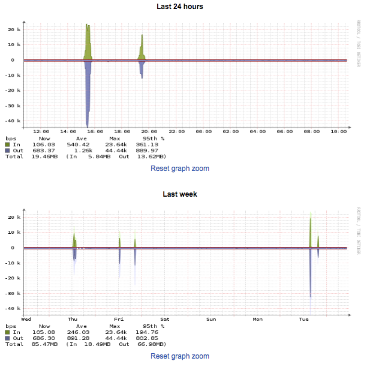

# Bandwidth usage

You can see bandwidth graphs showing traffic and packets per second (PPS) for most of your UKFast-hosted servers, with the current exception of eCloud and eCloud Flex virtual machines.

Login to [MyUKFast](https://www.ukfast.co.uk/myukfast.html) and go to `Dedicated Servers` via the `Products and Services` menu.

You will see a list of servers in your account.  Find the server you want to look at, and click on either the `IP` or `Name`.  When you're in the server go to the `Traffic` or `PPS` tab.

## Traffic
These graphs will show you the traffic that has been sent and received for this server over varying periods of time.


## PPS
These graphs will show you the packets per second that have been sent and received for this server over varying periods of time.


For a consolidated view of various usage metrics, including bandwidth, for your UKFast-hosted servers you can run a [PROProtection Report](/monitoring/proprotection)

```eval_rst
   .. title:: Monitoring | Bandwidth Usage
   .. meta::
      :title: Monitoring | Bandwidth Usage | UKFast Documentation
      :description: How to see your bandwidth usage 
```
