# Running a DPACK on a Linux Operating System.

## Running a standard DPACK:

**This section explains how to run a standard DPACK which allows a collection of up to 24-hrs.**

1. First create a folder and transfer the DPACK `tar` file using an SFTP client:

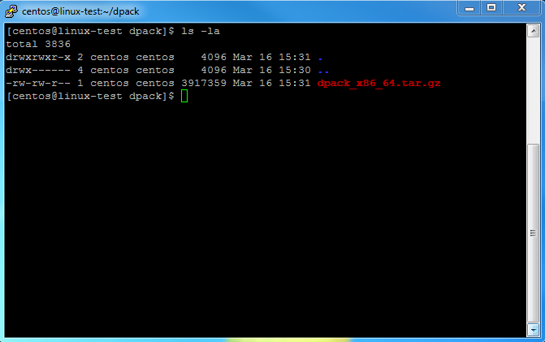

2. The DPACK `tar` file now needs to be extracted by entering the following command

```console
tar -xvzf dpack_x86_64.tar.gz`
```

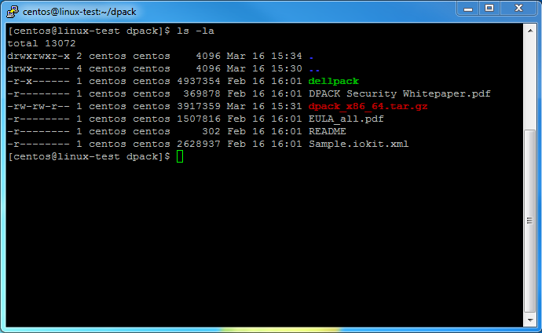

3. Start the executable `dellpack` and enter `yes` to the following prompt to allow the DPACK to run:

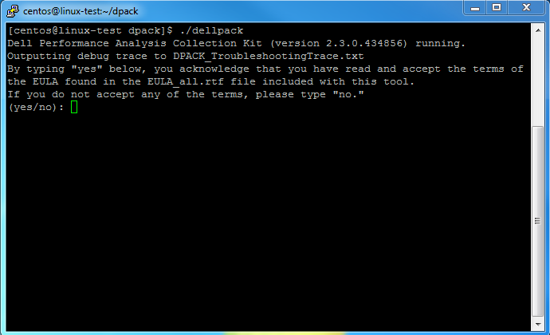

4. Please check that your information is correct on the page below as this will be sent to the engineers at UKFast. Enter `yes` when ready:

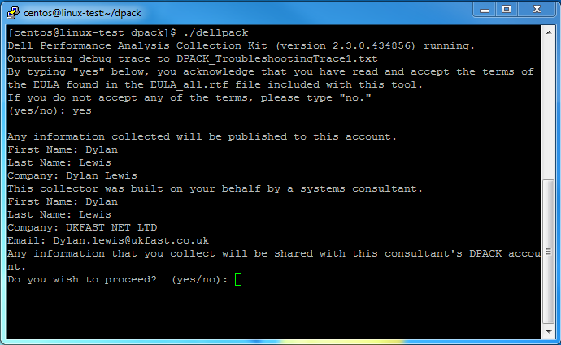

5. UKFast suggests you enter `yes` as the server metrics will then be streamed to our DPACK portal at UKFast and allows for easier analysis:

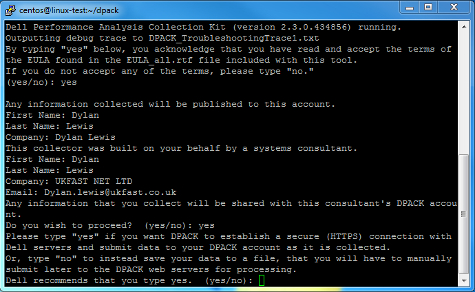

6. Please enter the `sudo` password for the local server so the DPACK can collect the relevant data:

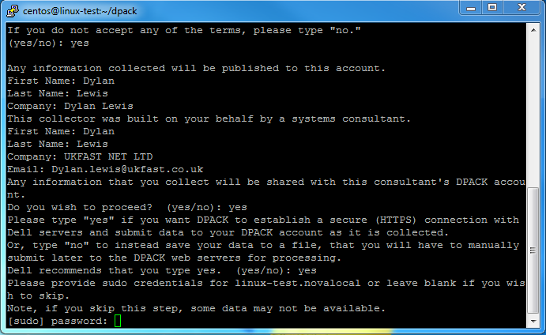

7. The console will now display each disk detected on the server / VM. We suggests you enter `yes` to all of them:

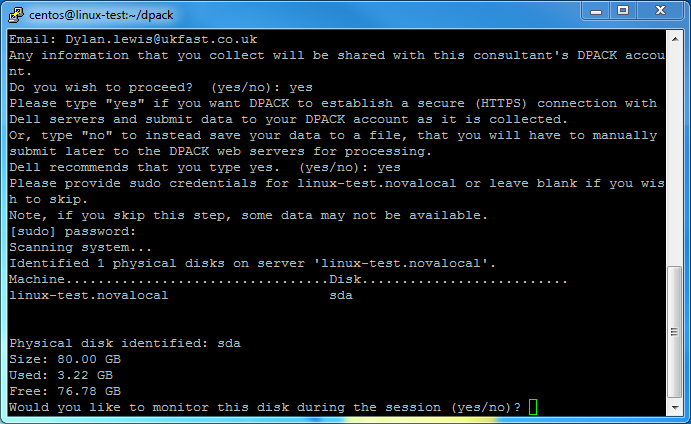

8. You should now be displayed with the DPACK Collection screen. You can now select any option and follow the prompts:

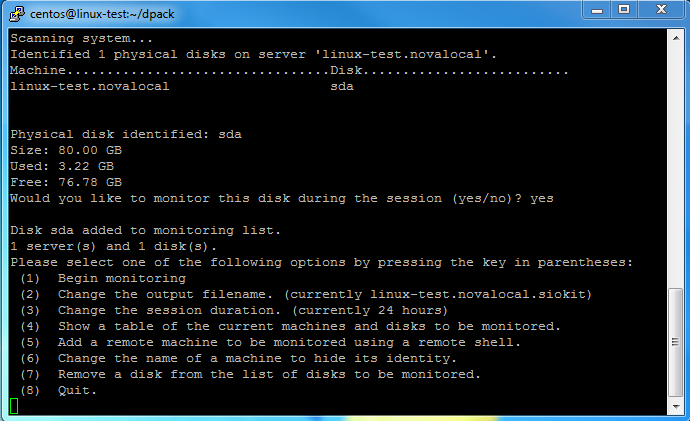

9. Once you have added all servers, you can enter `1` to begin the collection. You will then be asked if you want to run DPACK as a background process. Enter `yes`, so you can close your SSH connection. The collection will be streamed to the DPACK portal:

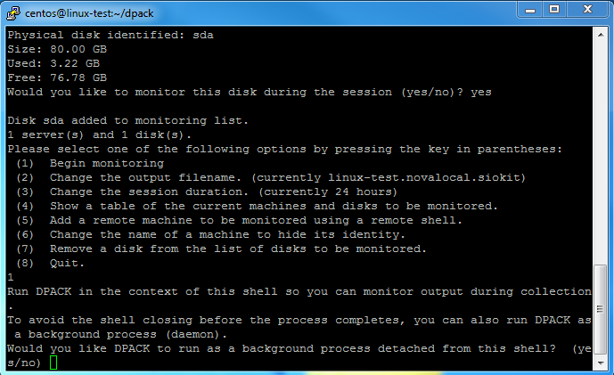

## Running an extended DPACK:

```eval_rst
.. note:: This section explains how to run an extended DPACK which allows a collection of up to 7-days
```

1. When you are in the DPACK folder start the executable `dellpack` with  the `-e` flag:

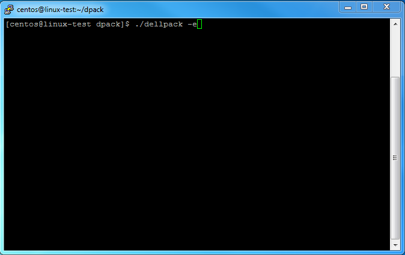

2. Follow the instructions above until you reach the DPACK Collection screen. Enter `3` to change the collection length in hours. 168 hours = 7-days.

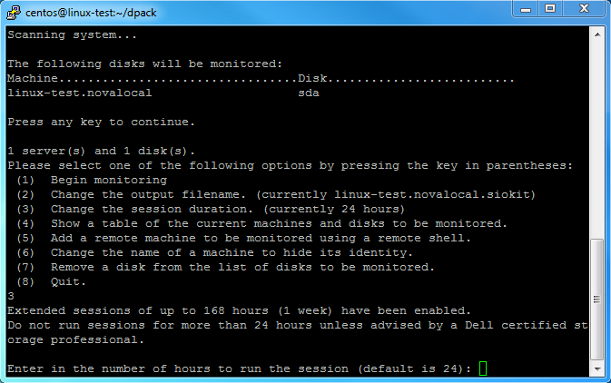

You are now able to run the DPACK for  up to 7-days. Any problems, don't hesitate to contact UKFast Support.

```eval_rst
   .. title:: Running a DPACK collection on Linux
   .. meta::
      :title: Running a DPACK collection on Linux | UKFast Documentation
      :description: Information on running DPACK collections on Linux
      :keywords: ukfast, dpack, liveoptics, linux
```
