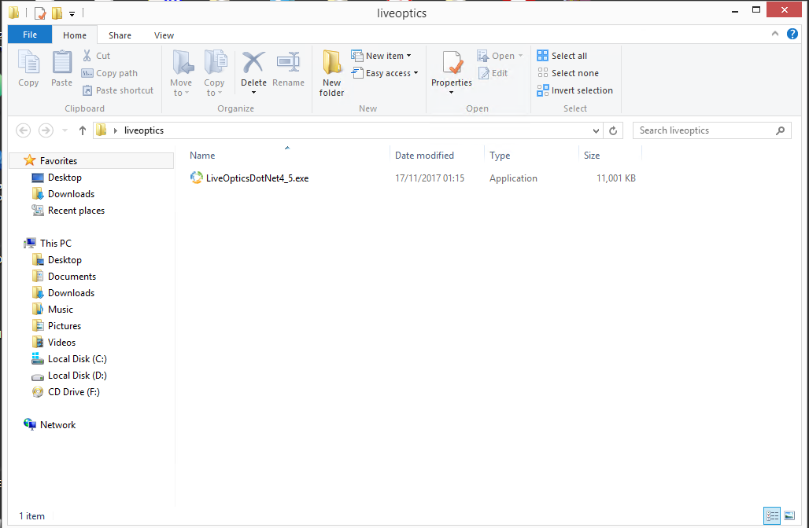
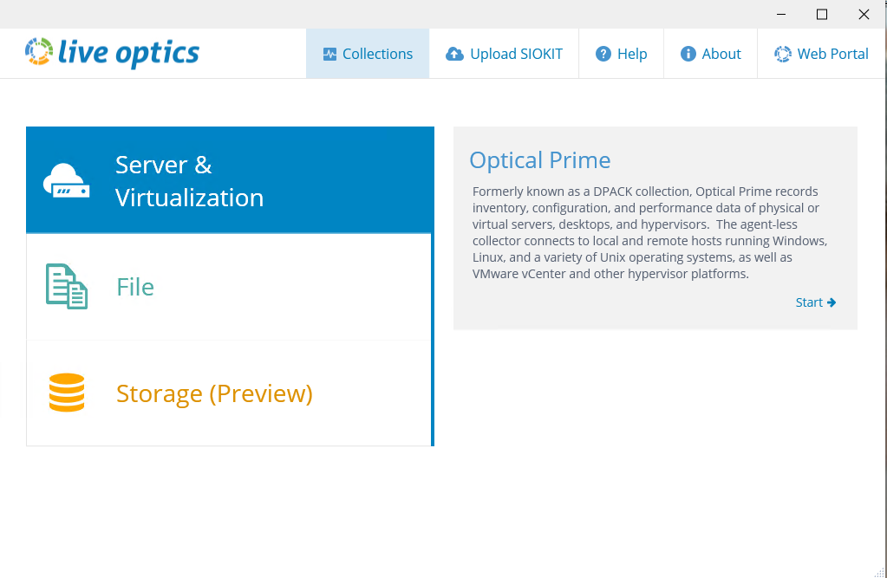
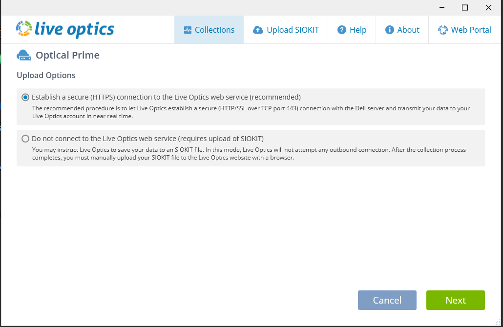
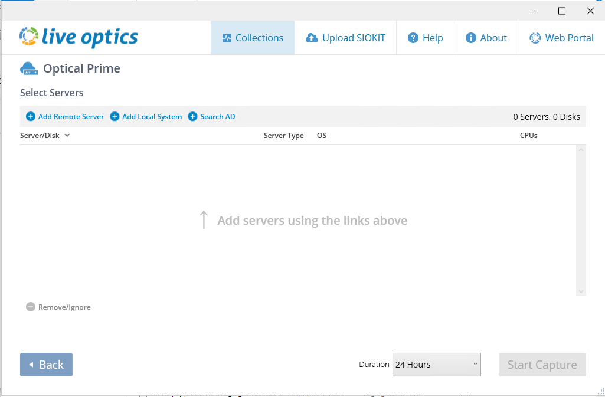
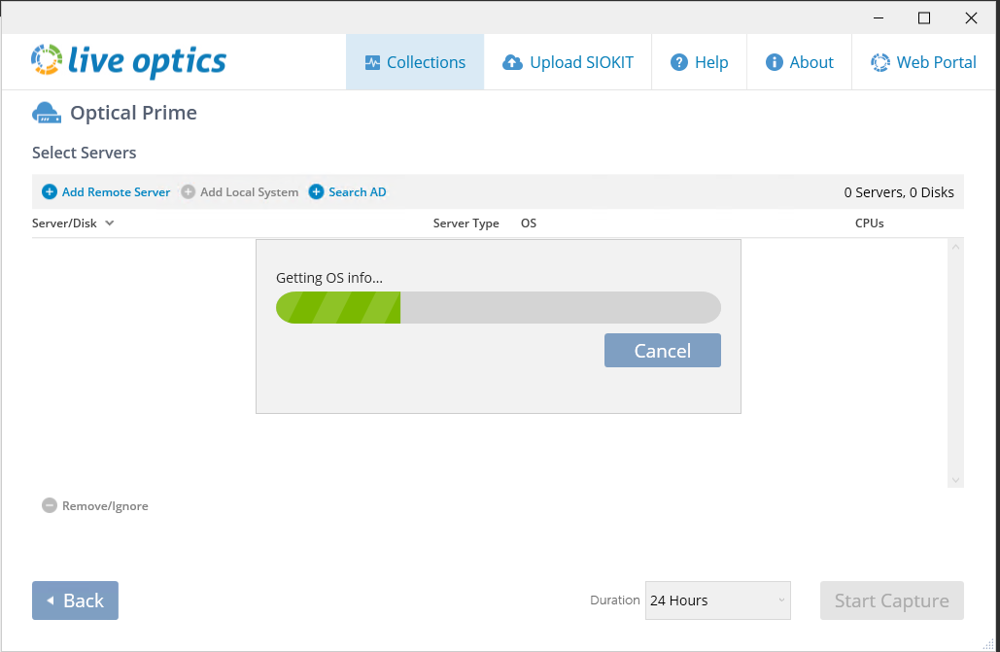
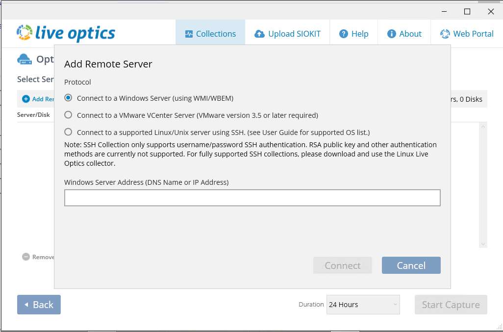
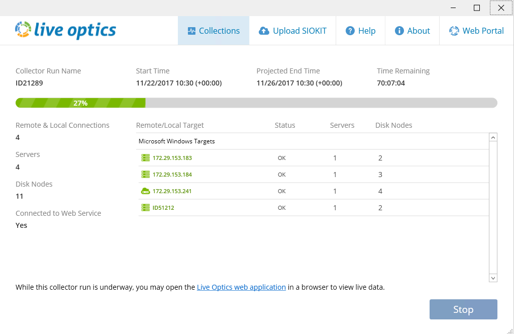

# Running a Live Optics capture on Windows Server Operating Systems.

## Running a standard Live Optics:

**This section explains how to run a standard Live Optics which allows a collection of up to 7 Days.**

**LiveOptics was previously named DPACK, it has since changed and has now become LiveOptics**

1. First create a folder and put the `LiveOpticsDotNet4_5.exe` in as it will create quite a few files when first started:



2. Select `Server & Virtualization` and then click on the `Optical Prime` window to the next pop-up to allow the Live Optics program to start:



3. UKFast suggests you keep the `Live Optics Data Options` to `Establish a secure (HTTPS) Connection to the Live Optics Web Service`, as with this option the server metrics are streamed to our Live Optics portal at UKFast, and it allows for easier analysis:



4. You should now be presented with the main Live Optics Collection Screen:



5. If you are going to take a collection of the local machine, select the `Add Local System` button on the portal:



6. If you are going to take a collection of a remote machine, select the `Add Remote System` button on the portal. You will then be shown the screen below which will allow you to remotely take a collection by supplying the `IP`, `username` and `password` of the remote server.



7. Once all the servers have been added, you can now select the `Start Capture` button and the collection will begin:



```eval_rst
  .. title:: Using Live Optics on Microsoft Windows
  .. meta::
     :title: Using Live Optics on Microsoft Windows | UKFast Documentation
     :description: How to run a Live Optics check on a Windows server
     :keywords: ukfast, liveoptics, live, optics, windows, server, monitoring, cloud, hosting
```
