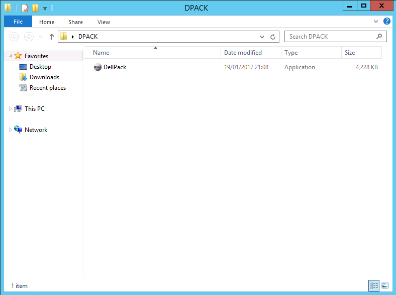
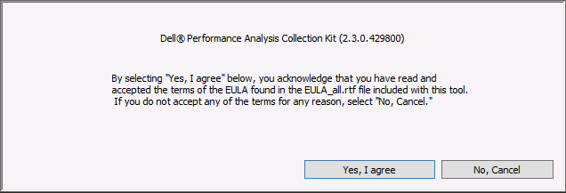
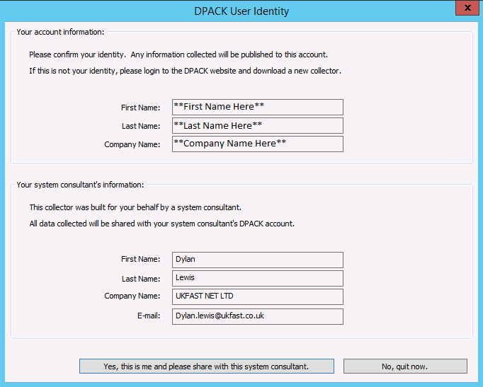
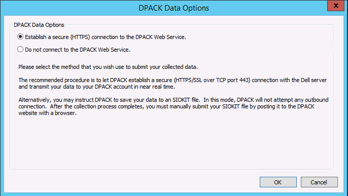
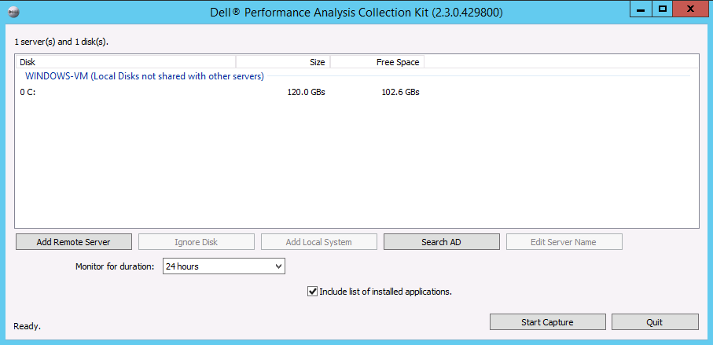
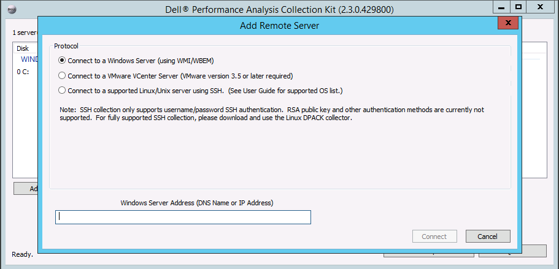
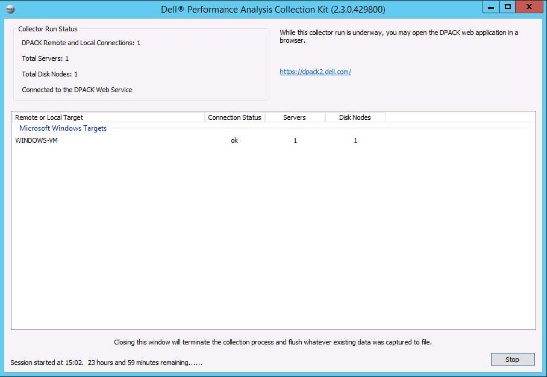
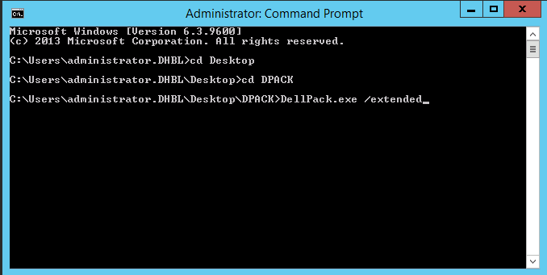
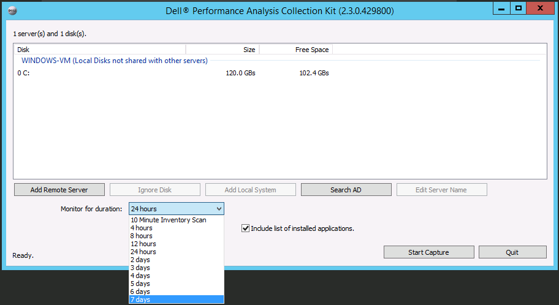

# Running a DPACK on Windows Operating Systems.

## Running a standard DPACK:

**This section explains how to run a standard DPACK which allows a collection of up to 24-hrs.**

1) First create a folder and put the DellPack.exe in as it will create quite a few files when first started:

2) Select "Yes, I agree" to the next pop-up to allow the DPACK program to start:

3) Please check that your information is correct on the page below as this will be sent to the Engineers at UKFast:

4) UKFast suggests you keep the DPACK Data Options to "Establish a secure (HTTPS) Connection to the DPACK Web Service" as the server metrics are streamed to our DPACK portal at UKFast and allows for easier analysis:

5) You should now be presented with the main DPACK Collection Screen:

6) If you are going to take a collection of the local machine, please select the "Add Local System" button on the portal:

7) If you are going to take a collection of a remote machine, please select the "Add Remote System" button on the portal, you will then be shown the screen below which will allow you to remotely take a collection by supplying the IP, Username and Password of the remote server.

8) Once all the servers have been added, you can select the "Start Capture" button and the collection will begin:

## Running an extended DPACK:

**This section explains how to run an extended DPACK which allows a collection of up to 7-days.**

1) First create a folder and put the DellPack.exe in as it will create quite a few files when first started:

2) Navigate to the folder location in CMD or Powershell and run the command "DellPack.exe /extended":

3) Follow the instructions from the standard section above until you reach the DPACK Collection Screen and add all the servers you want to collect from:

4) You should now be able to select the "Monitor for duration" tab and select up to 7-days:

You are now able to run the DPACK for 7-days. Any problems, don't hesitate to contact UKFast Support.
