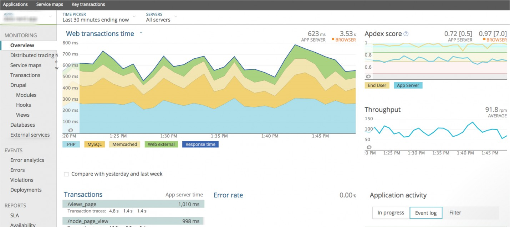
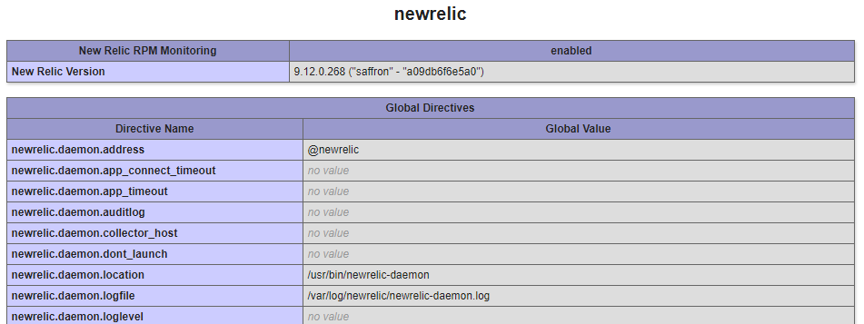
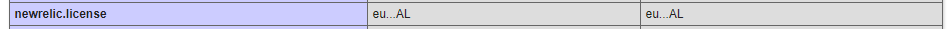

# How to install and configure New Relic PHP Agent on CentOS 7

In this article we will discuss how to install the New Relic PHP agent on a CentOS Server. New Relic is a third party developer tool that can provide indepth application monitoring which can be used to identify problem areas in the application, commonly performance related.

New Relic offers a [free tier account](https://newrelic.com/signup/) with "100 GB/month of free data ingest" for users to take advantage of that doesn't require using credit card info.

## Prerequsites 

- License key 
  - In order to install New Relic, you will need an **APM** [license key.](https://docs.newrelic.com/docs/accounts/install-new-relic/account-setup/license-key) 
- PHP compatibility 
  - New Relic supports popular frameworks and most new versions of PHP 5.3, 5.4, 5.5, 5.6, 7.0, 7.1, 7.2, 7.3, 7.4.
  - More information on the supported frameworks can be found in the [New Relic documentation](https://docs.newrelic.com/docs/agents/php-agent/getting-started/php-agent-compatibility-requirements).

## Install the agent

1. Sign into your New Relic account, go to **Account Settings** and take a copy of your **APM licence key**.

2. Log into the server using SSH and run the following command to tell the package manager about the New Relic repository:

```bash
 $ rpm -Uvh http://yum.newrelic.com/pub/newrelic/el5/x86_64/newrelic-repo-5-3.noarch.rpm
```

3. Install the New Relic `Agent` and `Daemon` using the below command:

```bash
 $ yum install newrelic-php5
 ```

4. Installing New Relic:
### Installation on a server with a single instance of PHP

 Run the following command to begin in the installation:

 ```bash
 $ newrelic-install install
 ```

### Installation on a server that is controlled by a panel (such as cPanel or Plesk)

If the server has a control panel, or the PHP binary is installed to an alternate location (eg. /opt), then you will need to specify the PHP path with the following commands prior to installation:

#### cPanel Example

```bash
$ NR_INSTALL_PHPLIST=/opt/cpanel/ea-php56/root/usr/bin:/opt/cpanel/ea-php71/root/usr/bin:/opt/cpanel/ea-php70/root/usr/bin:/opt/cpanel/ea-php73/root/usr/bin; export NR_INSTALL_PHPLIST
$ newrelic-install install
```

#### Plesk Example

```bash
$ NR_INSTALL_PHPLIST=/opt/plesk/php/7.1/bin:/opt/plesk/php/7.2/bin:/opt/plesk/php/7.3/bin; export NR_INSTALL_PHPLIST
$ newrelic-install install
```

Please ensure that for either of the above examples that you remember to change PHP paths to suit your enviroment. For example, if you are on cPanel and using PHP 7.4, you will need to include the path to the PHP 7.4 binary using the same format as the provided example.

### The New Relic Agent Installer:

This is where you will need the **APM license Key** and the installer will first ask you for it:

```bash
New Relic PHP Agent Installation (interactive mode)
===================================================

   Enter New Relic license key (or leave blank):
```

5. Restart the webserver.

- For `Apache` servers:
```bash
 $ systemctl restart httpd
```
- If running `php-fpm`:
```bash
$ systemctl restart php-fpm
```

```eval_rst
.. note::
  For Plesk/cPanel, you should confirm that you are restarting the correct web service - often, you can restart services within the control panel itself in Service Management/Manager
 ```

Now once New Relic has captured enough traffic, log back into your New Relic account and data should appear in the APM tab.



## Troubleshooting

If no data appears after 5 minutes make sure that you are generating some traffic to the website. New Relic will only display data it captures, if no traffic is hitting the website its possible the website may not hace had any visitors yet. 

If data is still not being produced after generating traffic to the website try the [Diagnostics tool](https://docs.newrelic.com/docs/using-new-relic/cross-product-functions/troubleshooting/new-relic-diagnostics) built by New Relic to identify issues.

To ensure the New Relic agent has been installed correctly, create a phpinfo() page in the websites document root.

For example:

```bash
 $ vi /var/www/vhosts/example.com/public_html/info.php
```
```bash
<?php phpinfo(); ?>
```
Now browse to example.com/info.php, if New Relic is installed correctly, you will see a section on New Relic.



Check that there is a valid license. 



If the license shows as `***INVALID***`, run the `newrelic-install install` again and ensure that license key is valid and correct.

```eval_rst
  .. title:: Install New Relic
  .. meta::
     :title: Install New Relic | UKFast Documentation
     :description: A guide to installing new relic on linux servers.
     :keywords: ukfast, linux, monitoring, newrelic, new relic, apm, tracing, performance
```
