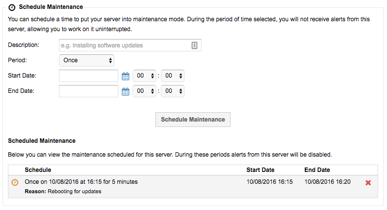

# How can I schedule downtime when performing maintenance?

If you need to perform some maintenance on your solution then you can schedule downtime within MyUKFast, so that alerts aren't raised during this window.  Here's how:

1. Login to [Portal ANS](https://portal.ans.co.uk)
2. Go to `Dedicated Servers` in the `Products and Services`
3. Find the server you need to work on from the list
4. Scroll down on the Details page to find the Schedule Maintenance section.
5. Complete the details and click `Schedule Maintenance`



```eval_rst
   .. title:: Monitoring | Scheduling Downtime
   .. meta::
      :title: Monitoring | Scheduling Downtime | ANS Documentation
      :description: Information on how to schedule downtime
```
