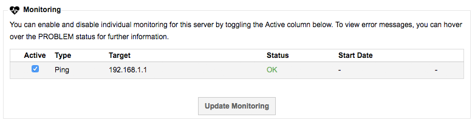

# Where can I view my monitoring results?

ANS offers a variety of monitoring options, the list of available ones for your server can be found in the following location in your [MyUKFast area](https://www.ukfast.co.uk/myukfast.html):

'Products and Services' > `Dedicated Servers`

Within this section you will be presented with a list of devices available to you. You can search and browse through these, clicking on the IP or Name to take you to the specific device.

On the Details tab you arrive on you should see the Monitoring section which will list all of the service checks assigned to this server along with the type of check and current status.



The monitoring options at UKFast are fairly extensive, if you haven't already discussed it with your account manager, it's worth doing so to find out the full scale of the offering.

```eval_rst
  .. title:: Viewing your monitoring results
  .. meta::
     :title: View my monitoring results | ANS Documentation
     :description: How to check your monitoring results
```