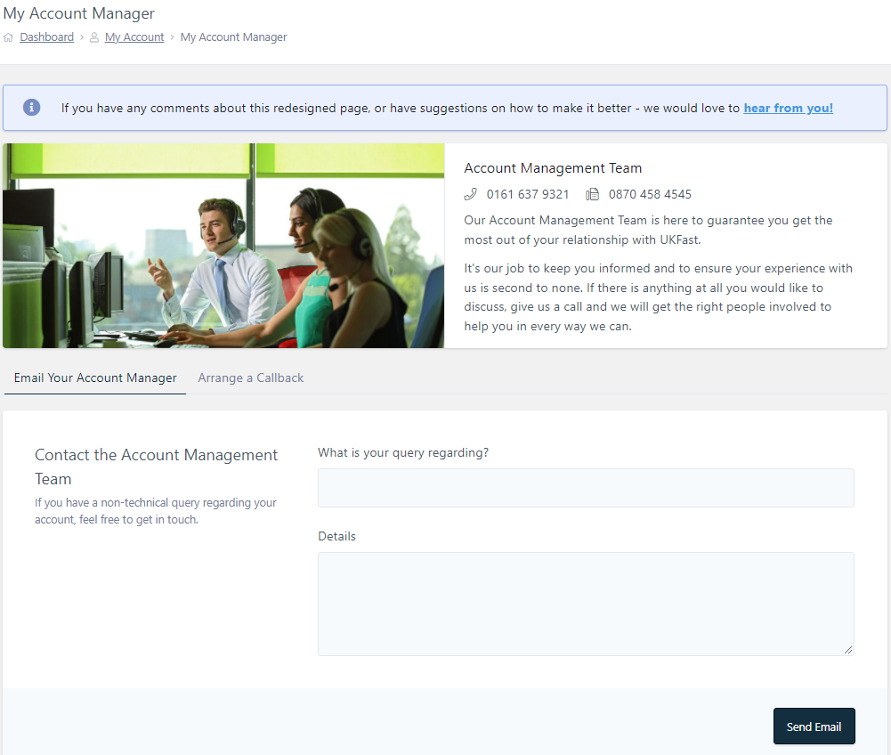

# How to Cancel and Close your UKFast Account

## Overview

This article will help you understand how to cancel your UKFast products and services, and delete your personal information from UKFast systems.

```eval_rst
.. tip::
  Before cancelling your account, please consider contacting support on 0161 215 3711 to help you troubleshoot any existing issues you may have. Alternatively you can raise a support ticket via the Priority Support System.

```

## Prerequisites
Before closing your UKFast account, there are a few things to consider.

* Are you the [**primary contact**](https://docs.ukfast.co.uk/myukfast/managing-contacts.html#primary-contact) on the account? Only the primary contact can close an account.
* Do you have a existing contract with UKFast? If so there may be restrictions on your ability to cancel products and services within an existing term.
* Do you have any products/services not in contract that can be removed?
  - [**Deleting eCloud Public v1 VMs**](https://docs.ukfast.co.uk/ecloud/public/delete-vm.html)
  - [**Deleting eCloud VPC instances**](https://docs.ukfast.co.uk/ecloud/ecloud-vpc/instances.html#delete-instances)
  - [**Deleting an eCloud VPC**](https://docs.ukfast.co.uk/ecloud/ecloud-vpc/vpc.html#deleting-your-vpc)
  - [**Deleting a Shared Exchange domain**](https://portal.ans.co.uk/shared-exchange/index.php)
* Do you have any outstanding bills? You can check this within the [**Billing**](https://docs.ukfast.co.uk/myukfast/billing.html) section of MyUKFast.
* Have you backed up any existing data you may have on your servers?
  - [**How to backup your MySQL databases**](https://docs.ukfast.co.uk/operatingsystems/linux/mysql/backups.html)
  - [**How to transfer files to and from a server**](https://docs.ukfast.co.uk/operatingsystems/windows/commonissues/copyfiletoserver.html)

## Closing your account
In order to begin the process of cancellation or account closure, you will need to contact your [**Account Manager**](https://portal.ans.co.uk/account/your-account-manager.php).

Contacting your **Account Manager** is very simple and they are available via *telephone* or *email*.

* You can find all of their contact details on the [**My Account Manager**](https://portal.ans.co.uk/account/your-account-manager.php) page in MyUKFast.
* When logged into MyUKFast, click **My Account > My Account Manager**.
* Additionally, you can send a message directly to your Account Manager to request a call back at a specific date and time, as below.



```eval_rst
   .. title:: How to Cancel and Close your UKFast Account
   .. meta::
      :title: How to Cancel and Close your UKFast Account | ANS Documentation
      :description: Instructions on how to cancel and close your UKFast account
      :keywords: ukfast, account manager, service manager, close account, cancellation, cancel, contract, quote, terminate, notice period, notice, upgrade, downgrade
```
