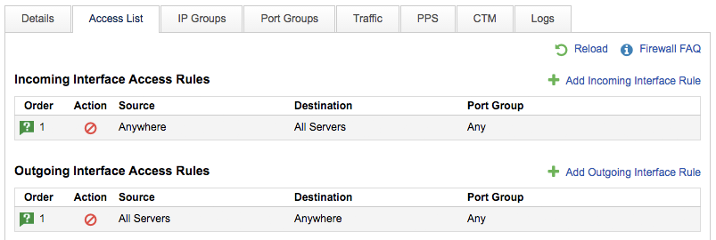

# How do I access my firewall config?

We provide the ability to manage your firewall rules online if it has been enabled. You can view your current rules and make changes within the MyUKFast portal.

To begin, you must first login to your [MyUKFast area](https://www.ukfast.co.uk/myukfast.html) and access the Network Devices link via the `Products and Services` menu, which is located across the top of the page.

Within this section you will be presented with a list of devices available to you. You can search and browse through these, clicking on the IP or Name to take you to the specific firewall.

You will now see some further tabs to navigate the device, you can click on the Access List tab.

Other articles will further describe the various functionality that is provided within this section.
