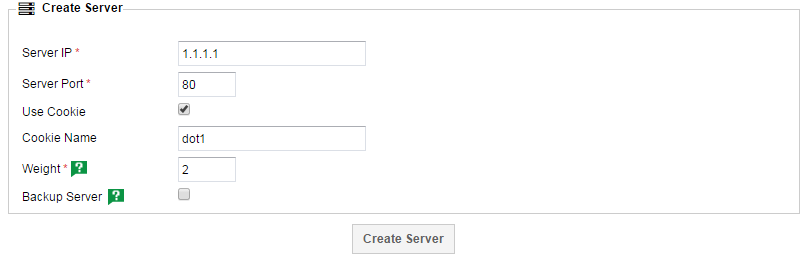

# Common Changes

This guide will go over some of the common changes you may want to carry out in the day to day administration of your loadbalancer server setup.

```eval_rst
.. note::
  This guide assumes general knowledge of the UKFast loadbalancer platform. The :doc:`/myukfast/loadbalancing/quickstart` guide is recommended reading, even if you have an existing loadbalancer configuration.
```

## Remove a server from the pool

It's fairly common to want to remove one of your servers from load, allowing it to be taken offline for upgrades or maintenance.

To do this, head to the `Server Groups` tab of your loadbalancer and then select the group you want to edit. From here, you should be confronted with something like this:



Lets say we want to remove `2.2.2.2` from load, leaving `1.1.1.1` to handle all requests for the time being. There are two main things we need to achieve:

* Stop new requests from arriving at the backend
* Stop existing sessions from being delivered to the backend

Open up the `2.2.2.2` backend by clicking the edit button on the far right.

To stop new requests from arriving at the backend, we need to change the `weight` to `0`, however a server with a weighting of `0` will still receive traffic from clients with a cookie pointing them at that backend.

To stop those sessions from arriving at this backend, we need to change the `Cookie Name` to something else temporarily. Changing it to `dot1-maintenance` will ensure that all the existing clients with the `dot1` cookie won't match against this backend, instead they'll be issued a new backend server from the pool.

Click the `Update Server` button and then `Reload Load Balancer Config` when prompted. Your changes should now be live with the server removed from load until you revert those changes.
