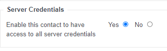

# Managing Contacts and Permissions in MyUKFast


## Primary Contact
The Primary Contact in any UKFast account has overall ownership and control of the contacts list and user permission levels.

## Changing Primary Contact
If there is the need to change the primary contact because, for example, the existing Primary Contact is leaving the company or changing roles, the current Primary Contact makes the change by going to the [Contacts](https://portal.ans.co.uk/account/list-contacts.php) section of MyUKFast.
If the existing Primary Contact has left the company, please contact your Account Manager who can facilitate changing the Primary Contact - you can find all of their contact details on the [My Account Manager](https://portal.ans.co.uk/account/your-account-manager.php) page.

## Review existing contacts
The Primary Contact in any UKFast account has overall ownership and control of the contacts list and user permission levels. To review and manage existing contacts on your account, go to the [Contacts](https://portal.ans.co.uk/account/list-contacts.php) section of MyUKFast.

The Primary Contact can control the level of access a contact has by clicking on their name in the [Contacts](https://portal.ans.co.uk/account/list-contacts.php) section and the clicking on **Access and Security**.

On this page a contact can be limited to only being able to log in to [MyUKFast](https://portal.ans.co.uk) from certain IP addresses and can have an pre-set **Access Profile** selected or a customised one set up to fine tune the type of access this contact has.


## Add new contacts
The Primary Contact can add new contacts by following these simple steps:

 1. Navigate to the [Contacts section](https://portal.ans.co.uk/account/add-contact.php), click **My Account > Contacts**
 2. Click **Add Contact** in the top right hand corner
 3. Fill out all required fields (marked *) followed by clicking **Add contact**
 4. You are now directed to the **Edit contact** page where you **Manage Subscriptions**, **Configure Alerts** and set **Access and Security Levels**
 5. When making changes to the above sections, ensure you save these changes by clicking **Update Contact** or **Update Security Settings** at the bottom of the relevant page

## Managing Access to Server Credentials

**Server Credentials** are available in MyUKFast for all servers in your account, but explicit access to this for contacts must be granted first.

1. Navigate to the [Contacts section](https://portal.ans.co.uk/account/add-contact.php), click **My Account > Contacts**.
2. Click the contact you wish to edit.
3. Click the **Access and Security** tab.
4. Scroll down to **Server Credentials** and select **Yes**.
5. Click **Update Security Settings** to save these changes.



```eval_rst
.. note::
   Please note that Support Teams cannot make this change on behalf of the Primary Contact.

```

## Configuring Alerts for all contacts
The [Alerts Manager](https://portal.ans.co.uk/alerts-manager/index.php) allows the Primary Contact to review and configure alerts for all users in their contact list.
 1. Navigate to the [Contacts section](https://portal.ans.co.uk/account/add-contact.php), click **My Account > Contacts**
 2. Click **Alerts Manager** in the top right hand corner
 3. Your list of contacts will be visible along with an indicator showing which alerts they are currently subscribed to.
 4. Click the appropriate icon to subscribe or unsubscribe to specific Alerts. Be sure to click **Save changes** when finished

The configurable Alerts are broadly split into 2 categories, "General" and "Server" and are further broken down, as follows:
 - General
   - Maintenance Alerts
   - Incident Alerts
   - Accounts Updates
   - Purchase Alerts
   - Product Renewal
 - Server
   - CTM Alerts
   - Monitoring Alerts
   - Backup Failure
   - Backup Quota
   - Backup Success
   - Security Audit
   - Server Incident
   - Threat Monitoring

If you have any questions about which alerts are the most appropriate for your contacts to receive, please contact [your Account Manager](account-manager).

```eval_rst
   .. title:: MyUKFast | Managing Contacts and Permissions
   .. meta::
      :title: MyUKFast | Managing Contacts and Permissions in MyUKFast | ANS Documentation
      :description: How to manage authorised contacts in MyUKFast
      :keywords: ukfast, account manager, service manager, primary contact, new contact, permission
```

