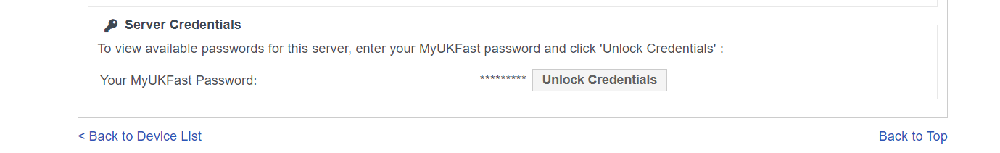
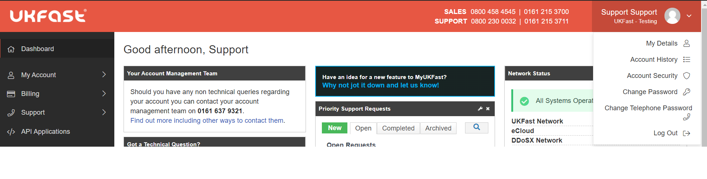
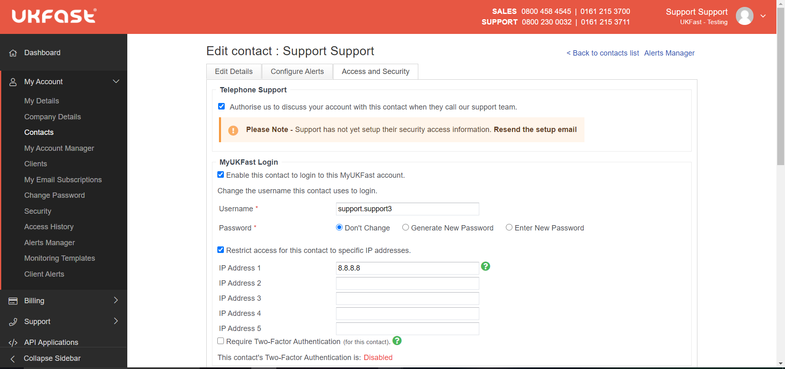

# Managing Passwords

There are several passwords which control access to different parts of your solution and MyUKFast account. Knowing where they are, how to access them and how to get them changed is a vital part of keeping your solution secure.

## Server Passwords

Passwords to access your server via SSH, RDP, FTP, MySQL and any panel product you may have installed can all be located by going to the **Server** or **eCloud** tab within [MyUKFast](https://my.ukfast.co.uk) 

To access your server credentials, browse to the Server or eCloud tab within MyUKFast and select your server's IP address from the list presented to you.

You will then need to scroll down to the Unlock Credentials button at the very bottom of the page. Enter your MyUKFast password and your server credentials will be displayed to you.



## Account Passwords

There are two types of passwords linked to your UKFast account; your MyUKFast account password and your Telephone Security password.

The **MyUKFast Account password** is used to gain access to MyUKFast and to server credentials whereas the **Telephone Security password** is used to verify the identity of anyone calling in to speak to our support team.

### MyUKFast Account Password

There are multiple ways to change your **MyUKFast account password** through [MyUKFast](https://my.ukfast.co.uk)

* Select **My Account > Change Password** from the left hand side option bar

* Hover over your name on the top right of the screen and select **Change Password**

* Select **My Account > Contacts** then click on the name of the contact whose password you wish to change then proceed to the **Access and Security** tab at the top of the next page. Under the heading **MyUKFast Login** you can select to have a new password automatically generated or to enter a new password yourself. You can only do this for another persons account if you are the primary contact on that account. 

If you have forgotten your MyUKFast password altogether you can simply click on the **Forgot your username or password?** links at the login page or call in to our support line on **0800 230 0032** and we are able to email out a password reset link to your contact email address.

### Telephone Security Password

Similarly there are multiple ways to change the **Telephone Security password** through [MyUKFast](https://my.ukfast.co.uk)

* Hover over your name on the top right of the screen and select **Change Telephone Password**



* Select **My Account > Contacts** then click on the name of the contact whose password you wish to change then proceed to the **Access and Security** tab at the top of the next page. Under the heading **Telephone Support** you should see a hashed out password, this can be replaced and saved over to update this to a password of your liking.



```eval_rst
.. warning::

  Unfortunately, we are unable to reset your Telephone Support password on your behalf due to it being our primary means of verifying your identity. However, if you're having issues following this guide then we can help you through doing it over the phone.
  
```

```eval_rst
   .. title:: MyUKFast | Managing Passwords
   .. meta::
      :title: MyUKFast | Managing Passwords 
      :description: Page providing information about managing your passwords within MyUKFast
      :keywords: ukfast, password, myukfast, account, access, telephone security, 
```
