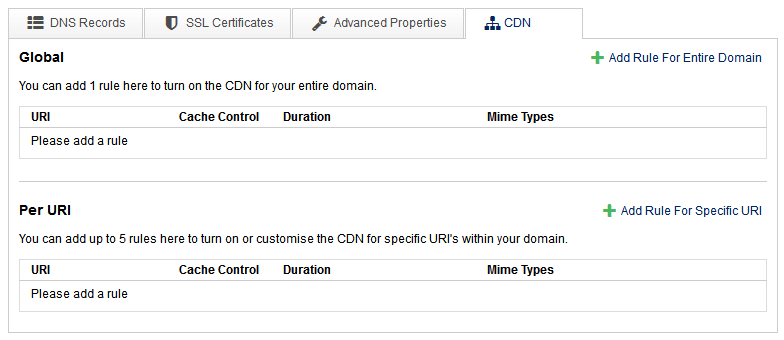
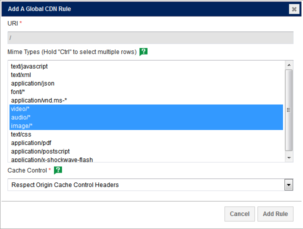

```eval_rst
   .. title:: Networking | Managed CDN Rules on DDoSX®
   .. meta::
      :title: Networking | Managed CDN Rules on DDoSX® | UKFast Documentation
      :description: How to Configure your Managed CDN Rules on DDoSX®

```

# Caching Rules
Cache control rules define the amount of time a file should be cached within the CDN network after the file is requested by the first visitor. This visitor must wait for the content to be delivered through CDN by the origin web server, but CDN will cache the file for subsequent visitors in the same region for the time specified by the caching rules. The longer your files are cached on the CDN network, the more likely it is that they will be available to the next visitor. However, this also means that it will take longer for your content to update across the network when this content is changed.

## Types of Cache Control
There are two types of cache control within CDN, "Respect Origin Cache Control Headers" and "Custom"
- **Respect Origin Cache Control Headers:** cache control headers are a feature of HTTP/1.1 and they allow full control of the time each static file on your website will be cached. These headers must be applied to each file that you would like CDN to cache, unless the file is included in a custom rule (below). <br />For guidance on setting cache control headers, view [this guide](https://varvy.com/pagespeed/cache-control.html).

- **Custom:** custom rules will override a file's cache control headers and add a general rule to the files of the specific MIME types you select. This enables the CDN to cache files that don't have any cache control headers set.

## Configuring Rules within MyUKFast
- Login to [MyUKFast](https://portal.ans.co.uk) and head to `DDoSX` in the `Products and Services` menu.
- Find the domain you would like to configure and select it.
- On the `Configure` page, select the `CDN` tab.



On this page you can add "Global" and "Per URI" rules, "Global" rules apply to your entire domain and "Per URI" rules apply to a specified domain extension only.

<h4><b>CLI:</b></h4>
```bash
ans ddosx domain cdn rule list mydomain.example
```

### Global Caching Rules
- Within the CDN tab of DDoSX, select `Add Rule for Entire Domain`



- Select the MIME types that you want CDN to cache (hold `Ctrl` to select multiple for this rule).
- Define the type of cache control (outlined [above](#types-of-cache-control)).

<h4><b>CLI:</b></h4>
```bash
ans ddosx domain cdn rule create mydomain.example --cache-control "Origin" --mime-type "font/*" --mime-type "text/javascript" --type "global" --uri "/"
```

>

- If selecting "Custom", use the drop-down menus to define the amount of time the content should be cached for.
- Select `Add Rule` to create this rule and repeat for all other rules.
- Once complete, select `Apply Changes` and your rules will be made active.

<h4><b>CLI:</b></h4>
```bash
ans ddosx domain cdn rule create mydomain.example --cache-control "Custom" --mime-type "font/*" --mime-type "text/javascript" --type "global" --uri "/" --cache-control-duration 3600s
```

### URI Specific Caching Rules
Following the same process as when adding global caching rules but with control over the domain extension.


For example, adding `/static-content` to the `URI` field will apply the rule to any content hosted within **http://www.example.com/static-content**

<h4><b>CLI:</b></h4>
```bash
ans ddosx domain cdn rule create mydomain.example --cache-control "Origin" --mime-type "font/*" --mime-type "text/javascript" --type "per-uri" --uri "/static-content"
ans ddosx domain cdn rule create mydomain.example --cache-control "Custom" --mime-type "font/*" --mime-type "text/javascript" --type "per-uri" --uri "/static-content" --cache-control-duration 3600s
```

Finally, click `Apply Changes` and your Cache rules will now be set up on the UKFast DDoSX<sup>®</sup> network, and configured appropriately. (You should allow up to 10 minutes for the changes to be fully applied)

<h4><b>CLI:</b></h4>
```bash
ans ddosx domain deploy mydomain.example
```

```eval_rst
.. meta::
     :title: Setting CDN caching rules | UKFast Documentation
     :description: Guidance to setting content caching rules on the UKFast CDN
     :keywords: caching, caching rules, cdn, content delivery, content delivery network
```
