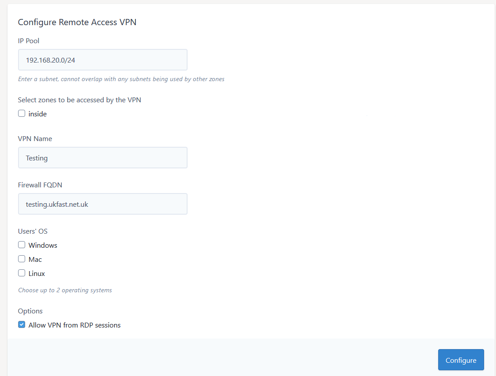

# Remote Access VPN Dashboard

## New AnyConnect VPN

If there is no configured AnyConnect VPN on the firewall the below screen will be displayed allowing you to setup a new VPN via the editor



### Required Elements:

#### IP Pool (default 192.168.20.0/24)

This is the IP range that will be allocated out by the firewall to each user as they connect to the VPN.  This range needs to be different than the range is use on your local 
network and that in use on your UKFast servers.

#### Zones To Be Accessed

Please select which zones on your firewall you would like to be able to access over the VPN.  This can be further restricted to individual servers by editing the access lists later

#### VPN Name (default company name)

This is the name that will show when you connect to the VPN.  It is the same for all users.

#### Firewall FQDN (default UKFast configured DNS)

This is the Fully Qualified Domain Name that will be used to connect to the firewall for the VPN.  This will also be used to create a self signed certificate on the firewall.  If you change this element you will need to create
the matching DNS record for the firewall IP.

#### Users' OS

Select the opertaing system that is in use of the end users machines.  This will affect the files that are installed on the firewall to allow access to the VPN.

#### Options

Allow VPN from RDP sessions (default is enabled) - selecting this will allow users who are connecting to the VPN from an RDP sessions to login successfully.

Once you have filled in all the required elements, click "Configure" and wait for the screen to confirm the VPN has been setup.  Please note this can take up to 1 minute to complete.

## Existing AnyConnect VPN


```eval_rst
  .. meta::
     :title: Remote Access VPN Administration | UKFast Documentation
     :description: Remote Access VPN Dashboard
     :keywords: ukfast, firewall, vpn, setup, remove access, AnyConnect, users
```
