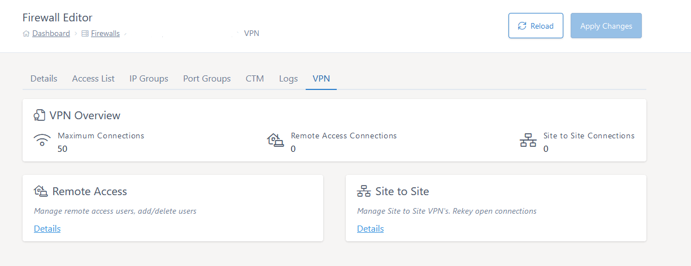

# VPN Dashboard

The VPN dashboard shows the current connection numbers for VPNs on your firewall and provides the access to the more detailed views of the two different types of VPNs that are available to you.



## Remote Access

These are the client-to-site VPN connections using the Cisco AnyConnect client.  If you have Remote Access VPNs setup on your dedicated firewall you can edit some elements of their setup via the online editor.  

You can add a user, remove a user, change passwords and/or group-policy for an AnyConnect VPN user all via the MyUKFast VPN tab and clicking on the **Details** link in the **Remote Access** section.  

If you don't have one configured you can setup a new AnyConnect VPN via the editor by clicking on the **Details** link in the **Remote Access** section.

## Site to Site

These are the VPNs setup between two IPSec capable devices. If you have VPNs setup on your dedicated firewall you can edit some elements of their setup via the online editor.  You can check the status and rekey live site-to-site VPN connections by clicking on the **Details** link in the **Site To Site** section.  

From this screen you can also click **edit** and you can then change the peer IP and/or pre-shared key in use on the VPN.

Please note, the change is not made to the firewall until you click **Apply Changes**.

```eval_rst
.. note::  
  If you require assistance with this, simply give the UKFast Support Team a call, or raise a Priority Support Ticket and we’ll be happy to advise/help.
```

```eval_rst
  .. title:: VPN | VPN Administration
  .. meta::
     :title: VPN Administration | UKFast Documentation
     :description: The VPN Tab
     :keywords: ukfast, firewall, vpn, setup, remove access, AnyConnect, site to site
```
