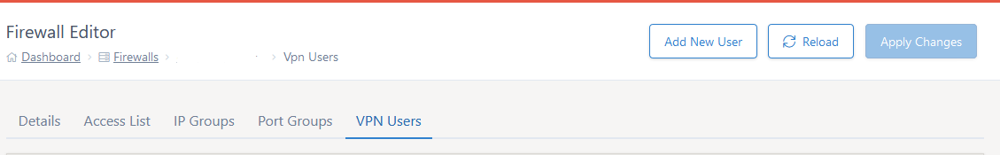
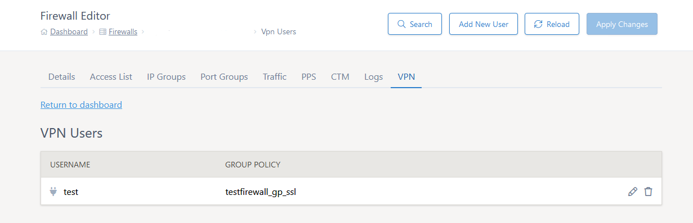

# User Administration For AnyConnect VPN

If you have an AnyConnect VPN setup on your dedicated firewal you can edit the user configuration via the online editor.  You can 
add a user, remove a user, change passwords and/or group-policy for a user all via the MyUKFast VPN Users tab.



## Add a New User

Once on the VPN Users tab you will see an option to "Add New User" near the top of the page.  Click this and you will be presented
with this screen:



Fill in the fields given and select the group-policy you would like applying to the new user (there may only be one in the list).  Then 
click add user.

Please note, the change is not made to the firewall until you click "Apply Changes".

## Editing an existing User

To edit an existing user click the user name in the list of users on the VPN Users tab.  This will give a page to make changes to passwords and/or group-policy.  Make the changes and click "Update User".

Please note, the change is not made to the firewall until you click "Apply Changes".

```eval_rst
  .. meta::
     :title: User Administration For AnyConnect VPN | UKFast Documentation
     :description: How to add/remove/edit AnyConnect VPN Users
     :keywords: ukfast, firewall, vpn, setup, remove access, AnyConnect
```
