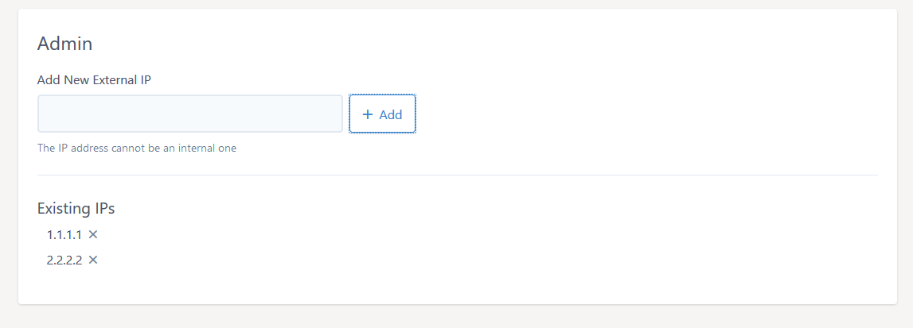
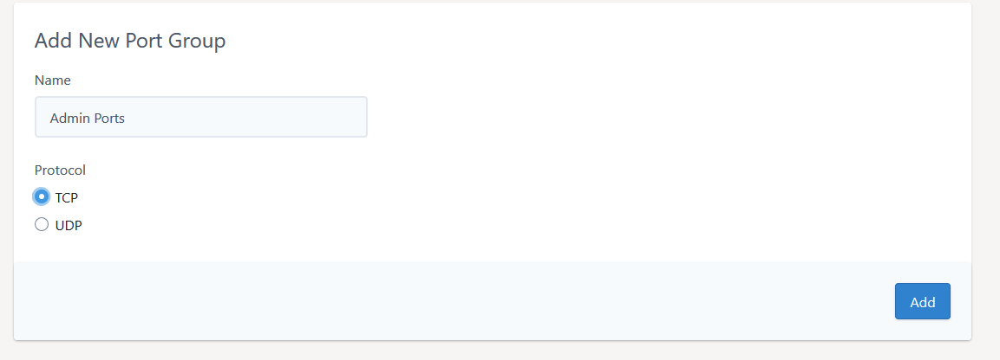
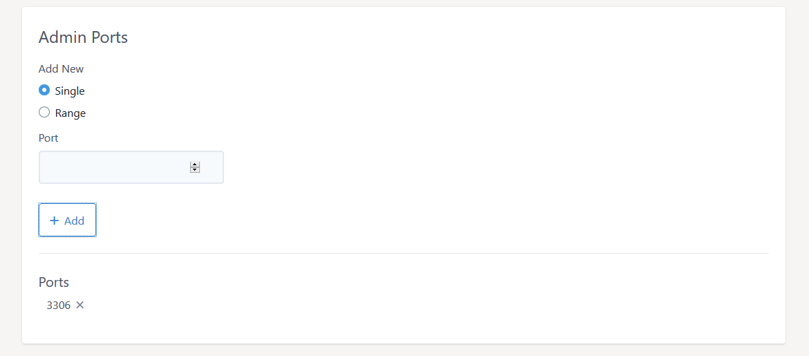
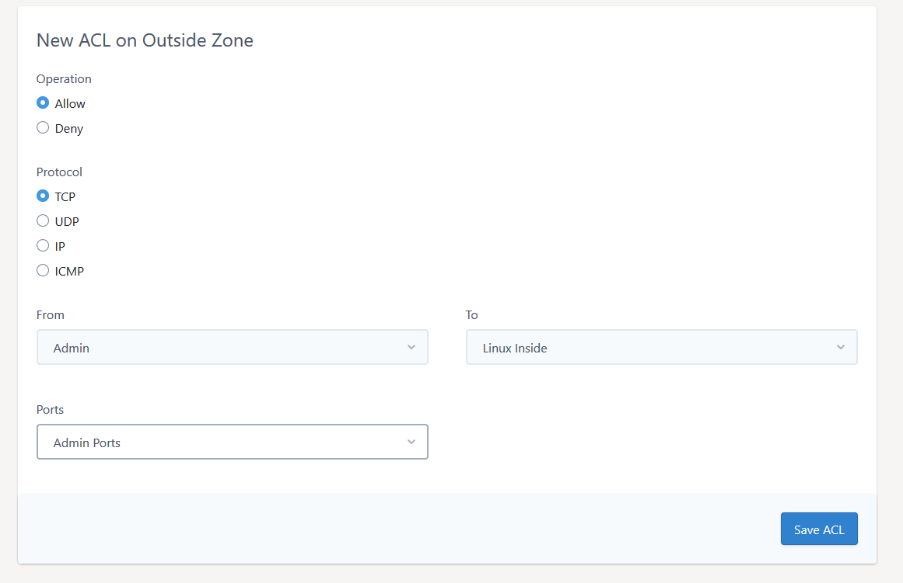
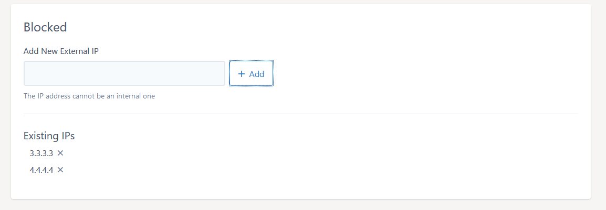
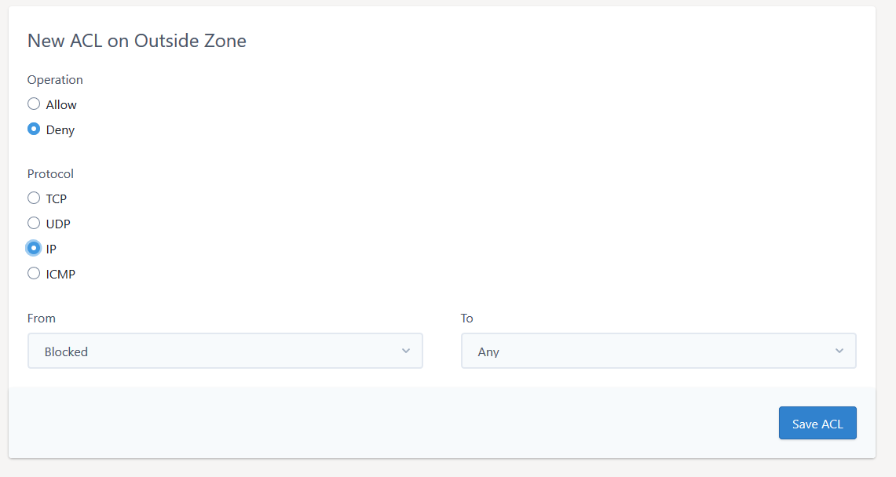

# How to secure your dedicated firewall

Your firewall is your first line of defence against malicious actors on the public internet. The best way to keep your server secure from attackers is to make sure they get blocked by your firewall.

## Locking down vital services to Admin IPs only

There are often services that you as the server owner will want to control access too. Common examples are SSH, RDP, MySQL, or even your control panels like Plesk or cPanel/WHM. While you and your authorized contacts need to access these, in general the rest of the internet does not. Leaving them open to the world allows attackers to attempt to exploit them.

Fortunately, there is an easy way to stop this. If you know the IPs you want to authorize, you can lock down these admin services on your firewall so only your authorized admin IPs are able to see these vital services. Lets say you want only your office IP to be able to access MySQL on your linux servers on port 3306.

To start, you'll want to create a new IP Group and select "External" and provide a name for the group (eg. Admin):



Then create an admin port group:



Add the 3306 port to the group:



Then we go to our Access list and create the rule:



Now for any new Admin IPs or services, you can add them to the existing groups.

## Blocking an IP

There are some situations where the best solution is to block an IP entirely. The best way to do this is to create a blocked IPs group, just as we did for the admin group:



Then we need to define all the ports we want to block. We can define a group of TCP or UDP ports or simply use the `IP` option in the Access List editor to block all ports.



You can drag and drop an access-list entry in the tab to move its position within the list. Make sure this block rule is first in your list by dragging it to the top. This ensures it's the first rule to be processed.

Our interface also allows you to add subnet ranges. If you are not familiar with how subnets work, they basically allow you to block a number of IPs in the same subnet range, by using a subnet mask. While it's possible to learn how to these ranges by hand, it is easy to use the many online tools, like this one from [MXtoolbox](https://mxtoolbox.com/subnetcalculator.aspx).

```eval_rst
.. warning::
    UKFast is not responsible for the performance of 3rd party software or testing tools.
```

```eval_rst
  .. meta::
     :title: Secure your dedicated firewall | UKFast Documentation
     :description: How to lock down and secure your UKFast dedicated firewall
     :keywords: ukfast, firewall, dedicated, secure, block, IP, port, ports
```
