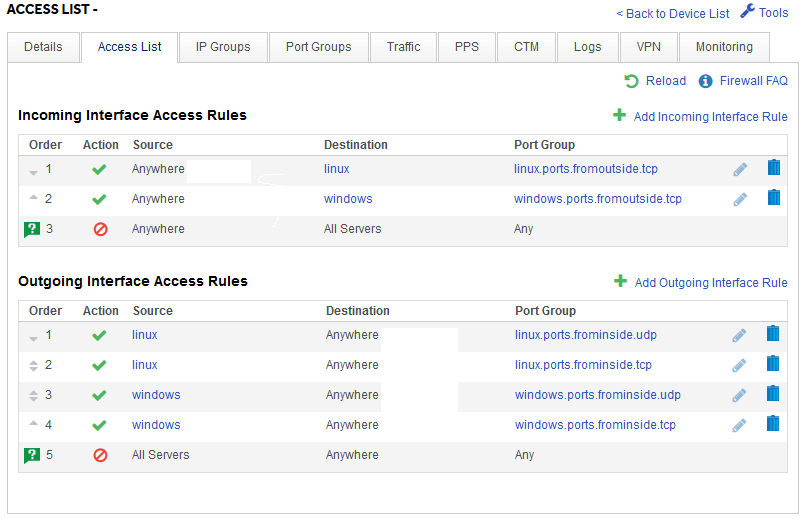
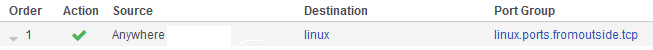
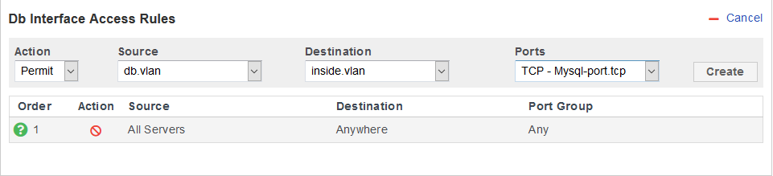
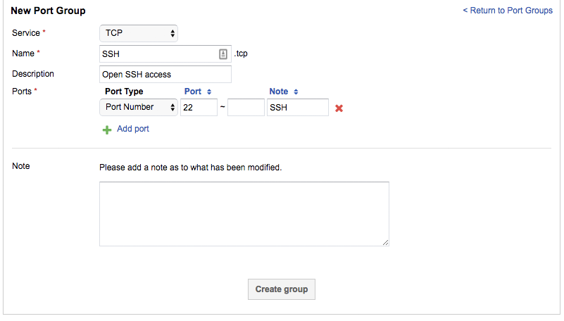
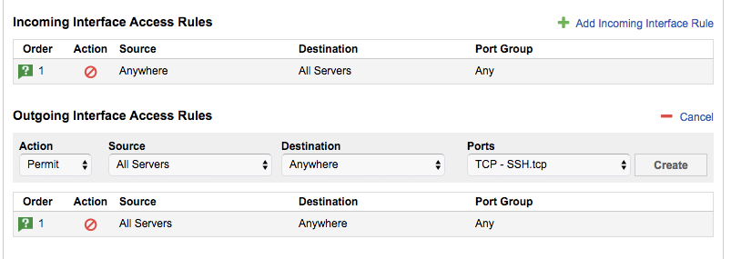
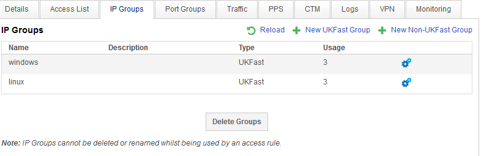

# Managing ports your dedicated firewall

You can open ports on your dedicated firewall within [MyUKFast](https://www.ukfast.co.uk/myukfast.html). Instructions on viewing your existing firewall configuration are provided in [this guide](viewconfig.html).

# The Access List - Single VLAN

Dedicated firewalls provide more flexibility over your access control, and as a result the interface is a little more complex than our shared firewalls. The main screen for looking at your dedicated firewall is called the Access List and it looks like this:



It is basically a list of rules that your firewall will apply to all traffic. Rules are processed in order, top to bottom, and each rule has 4 parts:

Action - If the traffic meets this rule, take this action. Actions can be Allow, or Deny.
Source - Where the traffic is coming from.
Destination - Where the traffic is going.
Port Group - Which ports the traffic is using.

If all these match, the firewall rule is applied to the traffic and it is allowed to pass, or denied, depending on the action selected. If it doesn't match then the next rule down is tried. Let's look at a single rule as an example:



The rule means Allow traffic from Anywhere, to "linux", on the ports "linux.ports.fromoutside.tcp".

# The Access List - Multi VLAN

Very much the same as a Single VLAN configuration, all of the terms are one and the same.  To allow inter-vlan communication a explicit rule from the source VLAN is needed.

An example rule can be found below:



This rule will allow your 'db.vlan' group to communicate to the 'inside.vlan' group on ports specified in the group 'Mysql-port.tcp'


## Creating a port group

You will note that we have something called Port Groups like "linux.ports.fromoutside.tcp". This lets us group lists of ports together and makes our Access List more readable and easier to maintain.

You may wish to add a Port Group if you don't already have a suitable group set up.  If so, go to the `Port Groups` tab and then create a `New Port Group`.  Select the service you would like to open this port for - either TCP or UDP. Provide a name and description for the port group.



You can add single ports or port ranges that you would like to open.  Once you are happy with the list, click on `Create Group`.

## Adding access rules to open ports

If you already have an existing port group, then you can add the required ports directly to this.  If you have just created a new port group, or the group hasn't previously been used, then you will need to add the actual access list to have the group take effect.

Click `Add Incoming or Outgoing Interface Rule`, select the action as `Permit`, then select the relevant source and destination options. Under `Ports`, select the new Port Group you created.



Click `Create` and the firewall configuration will be updated.

## IP groups

In addition to Port Groups, our example uses an IP group as a destination. This is a way of grouping multiple IPs with a friendly name to make our Access List more usable. In our example, the IP group is called "linux", and it contains all the IPs of our Linux servers. IP groups can be created and managed in the IP Groups tab.



So if we wished to apply all our existing firewall rules to a new Linux server, all we need to do is add the new server's IP into the "linux" IP group, and it will have all the same rules. Likewise if we want to change the Access List rules for all our linux servers, we can do so to all of them. As you can imagine, the more servers you have, the more powerful groups are.

```eval_rst
  .. meta::
     :title: Managing your dedicated firewall | UKFast Documentation
     :description: How to manage your dedicated UKFast firewalls
     :keywords: ukfast, firewall, port, ports, open, dedicated, access, rules, admin
```
