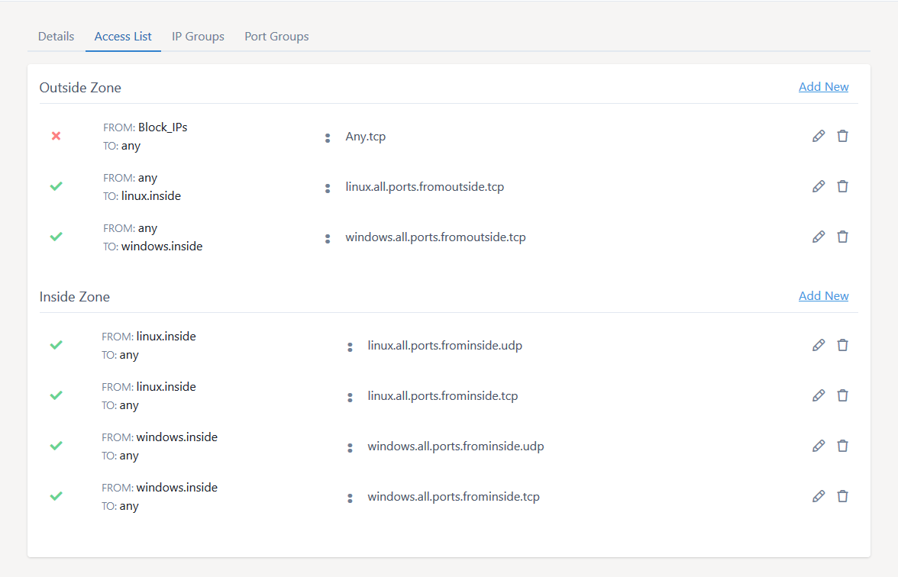
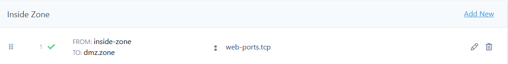
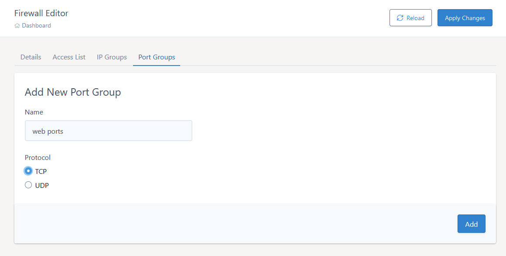
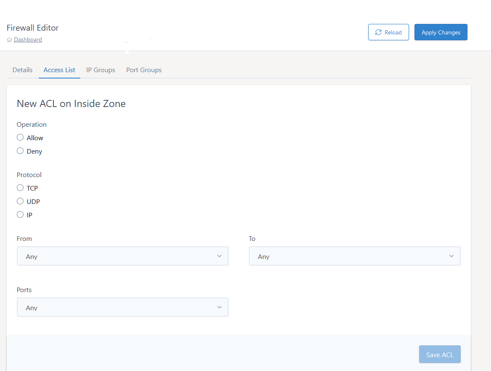

# Managing ports your dedicated firewall

You can open ports on your dedicated firewall within [MyUKFast](https://www.ukfast.co.uk/myukfast.html). Instructions on viewing your existing firewall configuration are provided in [this guide](viewconfig.html).

# The Access List - Single VLAN

Dedicated firewalls provide more flexibility over your access control, and as a result the interface is a little more complex than our shared firewalls. The main screen for looking at your dedicated firewall is on the Access List tab of the editor and it looks like this:



You will see an "outside" zone at the top of the editor.  This is the firewall zone facing the internet and it will govern traffic coming in from outside the solution to your servers.  You can permit public access to you servers or restrict this down to certain IP address/ranges that you would like to have access.

The other zone here is your internal zone, this governs traffic from your servers to the outside.

Each firewall zone has a list of rules that your firewall will apply to the traffic as it crosses the zone. Rules are processed in order, top to bottom, and each rule has 4 parts:

1. Operation - If the traffic meets this rule, take this action. Operations can be Allow, or Deny.
2. Source - Where the traffic is coming from.
3. Destination - Where the traffic is going.
4. Port Group - Which port the traffic is connecting to.

If criteria 2,3 and 4 match , the firewall rule is applied to the traffic and it is allowed to pass, or denied, depending on the operation (criteria 1). If it doesn't match then the next rule down is tried.  Please note, if a rule is matched no further rules are compared to the traffic and if no rule is matched the traffic will be denied. Let's look at a single rule as an example:


The rule means Allow traffic from "any" source, to "linux", on the ports "linux.ports.fromoutside.tcp".  You can hover your mouse over the name of the port and IP groups to see their contents.

# The Access List - Multi VLAN

Very much the same as a Single VLAN configuration but now you have more internal zones.  Inter-zone traffic is blocked by default, to allow inter-vlan communication an explicit rule from the source VLAN is needed.  This will need to be placed above the deny that prevents the inter-zone communication.  After creating a rule you can drag and drop it to the desired location in the access-list.

An example rule can be found below:



This rule will allow your 'inside zone' group to communicate to the 'dmz zone' group on ports specified in the group 'web ports'


## Creating a port group

You will note that we have something called Port Groups. This lets us group lists of ports together and makes our Access List more readable and easier to maintain.

You may wish to add a Port Group if you don't already have a suitable group set up.  If so, go to the `Port Groups` tab and then click the `Add a Group` button (above and to the left of the tabs).  Select the service you would like to open this port for - either TCP or UDP, provide a name and click `Add`.



You can add single ports or port ranges that you would like to open. Each is added to the group by clicking `Add`.  You can then click other tabs to either use the group in an ACL or create other port or IP groups.


You can also delete port groups by clicking the `bin` icon next to the group.  You can only delete a port group if it is not used in an access-list so you may need to delete some ACL's before the `bin` icon can be clicked.

Please note all changes made are only stored locally.  When you have made all your desired changes please click `Apply` to send the config change to the firewall at which point they will take effect.

## Adding access rules to open ports

If you already have an existing port group, then you can add the required ports directly to this.  If you have just created a new port group, or the group hasn't previously been used, then you will need to add the actual access list to have the group take effect.

On the `Access Lists` tab, find the access-list you would like to add a rule to and click `Add New`.  You then need to select the following:

1. Operation (Permit/Deny)
2. Protocol
3. From (source)
4. To (Destination)
5. Ports

The groups available in 3,4,5 are listed in a dropdown and are limited to valid groups for the access-list you are editing.



Click `Save ACL` and the local configuration will be updated.

You can also delete ACL entries by clicking the `bin` icon next to the entry.

Please note all changes made are only stored locally.  When you have made all your desired changes please click `Apply` to send the config change to the firewall at which point they will take effect.

## IP groups

In addition to Port Groups, our example uses an IP group as a destination. This is a way of grouping multiple IPs with a friendly name to make our Access List more readable. In our example, the IP group is called "Linux Inside", and it contains all the IPs of our Linux servers. IP groups can be created and managed in the IP Groups tab.


So if we wished to apply all our existing firewall rules to a new Linux server, all we need to do is add the new server's IP into the "linux" IP group, and it will have all the same rules. Likewise if we want to change the Access List rules for all our linux servers, we can do so to all of them. As you can imagine, the more servers you have, the more powerful groups are.

You may wish to add an IP Group if you don't already have a suitable group set up.  If so, go to the `IP Groups` tab and then click the `Add a Group` button (above and to the left of the tabs).  Select Internal (a group of IPs behind your firewall) or external (a group of IPs outside the firewall) provide a name and click `Add`.


You can add domains, single IPs or IP ranges. Each is added to the group by clicking `Add`.  You can then click other tabs to either use the group in an ACL or create other port or IP groups.  


Only valid IPs/IP ranges can be entered and this will be limited based on whether you selected an `Internal` group or an `External` one.  For example you can only put IPs that are valid as being behind your firewall in an `Internal` group.

You can also delete IP groups by clicking the `bin` icon next to the group.  You can only delete a IP group if it is not used in an access-list so you may need to delete some ACL's before the `bin` icon can be clicked.

Please note all changes made are only stored locally.  When you have made all your desired changes please click `Apply Changes` to send the config change to the firewall at which point they will take effect.

```eval_rst
  .. title:: Managing your dedicated firewall
  .. meta::
     :title: Managing your dedicated firewall | UKFast Documentation
     :description: How to manage your dedicated UKFast firewalls
     :keywords: ukfast, firewall, port, ports, open, dedicated, access, rules, admin
```
