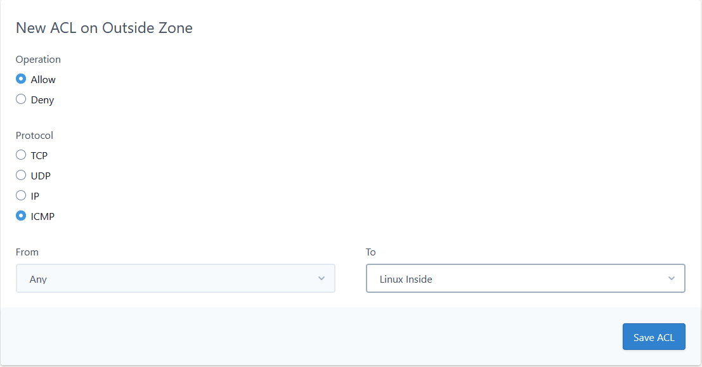

# Enabling ICMP traffic to UKFast servers

Internet Control Message Protocol (ICMP) is a standard internet protocol, usually used for diagnostics.

All ICMP traffic from the public Internet to your servers is disabled by default. This means your servers will not respond to ping requests, and it means you cannot run traceroutes from your servers. As outbound ICMP is allowed, you can still send ping requests from your servers. We do this to increase your security and prevent ICMP based Denial of Service attacks (AKA, ping floods, ping of death) against our network and your servers.

While we consider it good security to keep this traffic disabled, we appreciate some of our clients may require inbound ICMP traffic. If you are using one of our dedicated firewalls and wish to enable either inbound ICMP ping or traceroute for your solution you can do this via the firewall editor.

You can create the rule like this:



Please note this will allow all ICMP message types, if you wish to restrict this to certain ICMP types please [raise a support request via MyUKFast](https://portal.ans.co.uk/pss/create).

Unfortunately, if your solution is behind a shared firewall, we will not be able to enable inbound ICMP to your server.


```eval_rst
  .. title:: Enabling ICMP for UKFast servers
  .. meta::
     :title: Enabling ICMP for UKFast servers | UKFast Documentation
     :description: ICMP on UKFast shared and dedicated firewalls
     :keywords: ukfast, firewall, icmp, ping, traceroute
```
