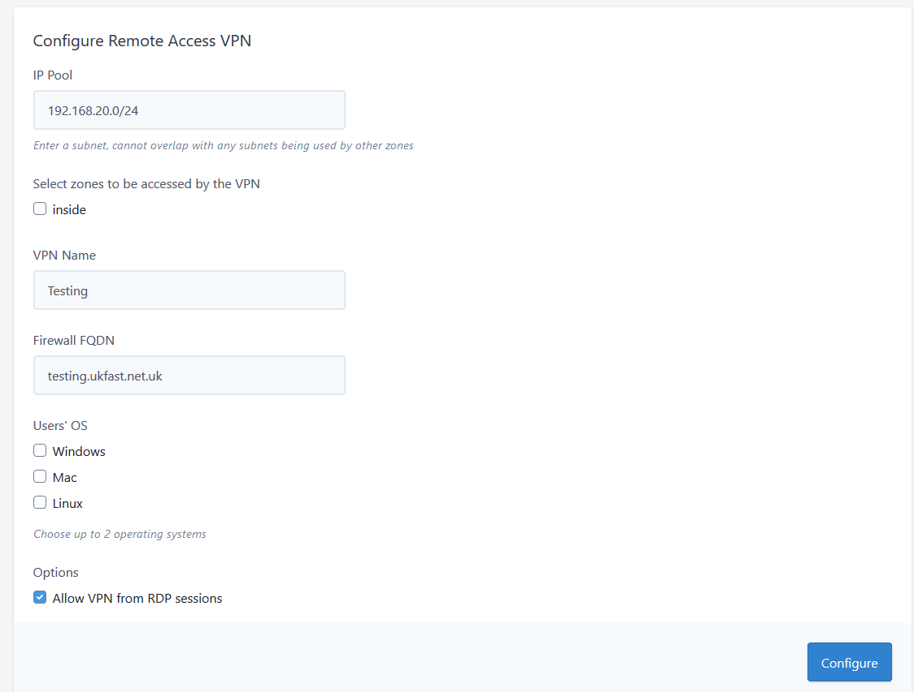
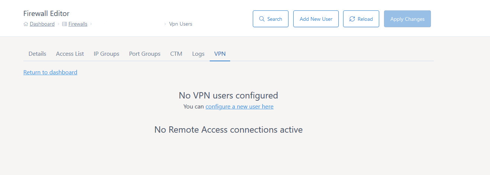
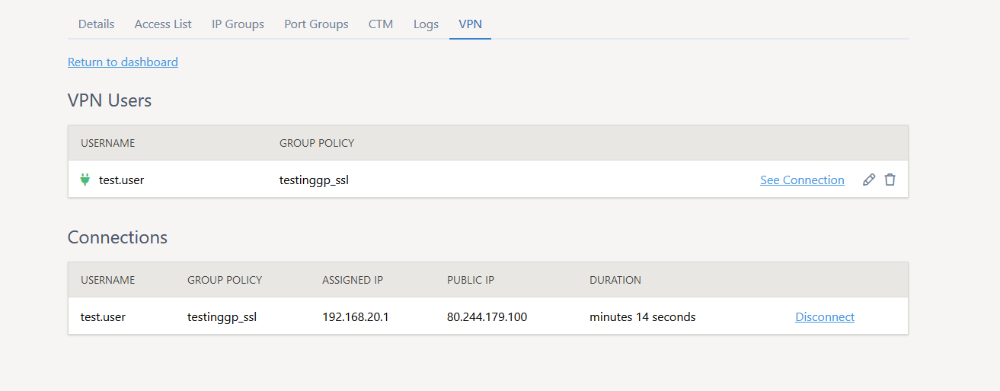

# Remote Access VPN Dashboard

## New AnyConnect VPN

If there is no configured AnyConnect VPN on the firewall the below screen will be displayed allowing you to setup a new VPN via the editor



### Required Elements:

#### IP Pool (default 192.168.20.0/24)

This is the IP range that will be allocated out by the firewall to each user as they connect to the VPN.  This range needs to be different than the range in use for local
network and that in use on your UKFast servers.

#### Zones To Be Accessed

Please select which zones on your firewall you would like to be able to access over the VPN.  This can be further restricted to individual servers by editing the access lists later

#### VPN Name (default company name)

This is the name that will show when you connect to the VPN.  It is the same for all users.

#### Firewall FQDN (default UKFast configured DNS)

This is the Fully Qualified Domain Name that will be used to connect to the firewall for the VPN.  This will also be used to create a self signed certificate on the firewall.  If you change this element you will need to create
the matching DNS record for the firewall IP.

#### Users' OS

Select the operating system that is in use of the end users machines.  This will affect the files that are installed on the firewall to allow access to the VPN.

#### Options

Allow VPN from RDP sessions (default is enabled) - selecting this will allow users who are connecting to the VPN from an RDP sessions to login successfully.

Once you have filled in all the required elements, click **Configure** and wait for the screen to confirm the VPN has been setup.  Please note this can take up to 1 minute to complete.

## Existing AnyConnect VPN

If there are no users configured on the firewall and the device is using local authentication for VPN users you will see the option to add a user.



If there are users configured, this page will list usernames on the firewall and their connection status.



Here you can add/remove/edit users, disconnect specific users from the VPN and by clicking the **Add New User** button you can create additional VPN users.

Please note that if your VPN users are not authenticated against the firewall's local database the user editing options will not be available but you can still disconnect users.

## Connecting to the VPN

1. Connect to the firewall hostname in your browser on port 443 using the https:// prefix.  Log in using the credentials created
2. You should then be able to download and install the AnyConnect application from the firewall
3. Open the application and click the small cog wheel in the bottom left hand corner
4. Select the preferences tab
5. Uncheck the box marked "block connections to untrusted servers".  This will allow you to connect to the firewall even though it is using a "self signed" certificate.  On    first connection you can then accept and import the self-signed certificate so you will not see this warning again.  If you would like CA signed certificate on the firewall      please contact your account manager who can help get this arranged for you
6. Go back to the main screen of the application and enter your firewall hostname in the box and click connect
7. You will need to accept the security warning that pops up.  This is related to the certificate mentioned above
8. You will then be prompted for your username and password configured previously
9. Once connected you will have full access to your servers on their internal IPs

```eval_rst
.. note::
  If you require assistance with this, simply give the UKFast Support Team a call, or raise a Priority Support Ticket and we'll be happy to advise/help.
```

```eval_rst
  .. title::  VPN | Remote Access VPN Administration
  .. meta::
     :title: Remote Access VPN Administration | ANS Documentation
     :description: Remote Access VPN Dashboard
     :keywords: ukfast, firewall, vpn, setup, remote access, AnyConnect, users
```


